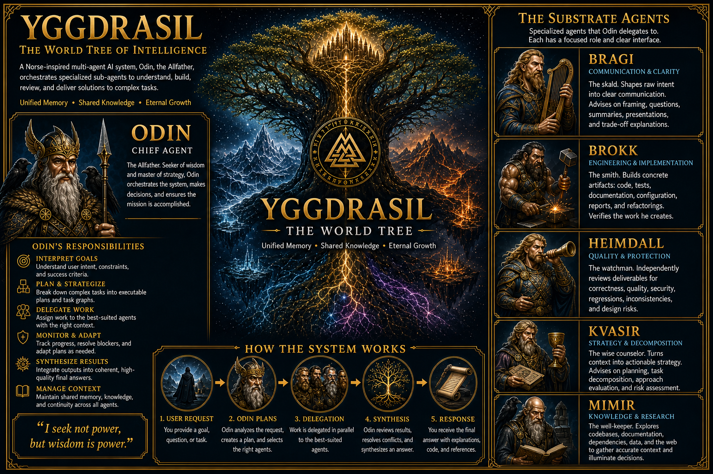

# Yggdrasil — The Norse Pantheon of AI Agents

> *From the roots of knowledge to the heights of creation, the world-tree connects all realms — and so too does Yggdrasil unite a pantheon of specialized agents, each embodying a god of old.*

---



## Introduction

In Norse mythology, **Yggdrasil** is the immense ash tree at the center of the cosmos, whose roots and branches connect the nine realms. At its base lies Mímisbrunnr — the Well of Wisdom — and around it the deeds of gods, giants, and mortals unfold.

This system draws its name and soul from that mythic tree. **Yggdrasil** is an orchestrated collective of autonomous AI agents, each one modeled after a Norse deity with a distinct domain of expertise. Together, they form a complete task lifecycle — from research and analysis to implementation, review, and orchestration.

Like the world-tree itself, Yggdrasil binds disparate strengths into a unified whole.

## Quick Installation

### Prerequisites

- [OpenCode](https://github.com/sst/opencode) installed and configured on your system (requires `~/.config/opencode/` directory).

### Basic Install

The repository includes a setup script that installs all agent and skill definitions:

```bash
./setup.sh
```

You'll be prompted for two interactive choices:

1. **Copy default skills?** — We ship with curated starter skills for all agents. You can decline to skip this, or accept to install them (default: yes).
2. **Confirm merge?** — Only shown if target directories already contain files. Default is to skip. The script performs a merge: same-named Yggdrasil files are overwritten, new files are added, and pre-existing unrelated files are preserved (never deleted).

To skip both prompts (for CI, non-interactive installs, or `curl ... | bash`), pass the `-y` flag:

```bash
./setup.sh -y
```

**What gets installed:**

- **Agents** → `~/.config/opencode/agents/yggdrasil/`
- **Skills** (if accepted) → `~/.config/opencode/skills/yggdrasil/`
- **Capability generator** → `~/.config/opencode/yggdrasil/generate-capabilities.sh`
- **Custom-capabilities scaffold** → `~/.config/opencode/yggdrasil/custom-capabilities.yaml` (first install only; never overwritten on upgrades)
- **Capability inventory** (generated automatically if skills are installed) → `~/.config/opencode/skills/yggdrasil/shared/capability-inventory/SKILL.md`

The capability inventory is a critical generated file that both Odin and Kvasir use to route work and understand available capabilities. It's automatically regenerated at install time and whenever you run the generator after adding custom tools.

### Custom Installation Path

By default, everything installs to `~/.config/opencode/`. To use a different location, set `OPENCODE_CONFIG_BASE` as an environment variable or use the `-c`/`--config-base` CLI flag:

```bash
# Environment variable
OPENCODE_CONFIG_BASE=/custom/path ./setup.sh -y

# CLI flag (takes precedence)
./setup.sh -c /custom/path -y
```

The path supports `~` expansion (e.g., `~/my-opencode-config`).

### Upgrades

When you run `./setup.sh` again after pulling the latest framework updates, it performs a safe upgrade:

- **Agent files** that have been locally modified are backed up with a timestamp suffix (e.g., `odin-autonomous.md.bak.1234567890`) before being overwritten. Review your backup to recover any custom permission grants and re-apply them to the new version.
- **Skill files** are overwritten if they match the current version; they're never backed up.
- **Custom-capabilities.yaml** is never touched — your custom tool grants are always preserved.
- **Capability inventory** is automatically regenerated to reflect framework updates and any new custom capabilities you've added.

If skills were skipped during install, the capability inventory regeneration is also skipped (and will need to be done manually later if you install skills).

### Default Skills

Yggdrasil ships with a curated set of default skills:

- **Bragi:** Presentation structuring, Question formulation, Trade-off communication
- **Brokk:** API design, Backend development, Database development, DevOps, Documentation writing, Frontend development, Git, Refactoring, Testing
- **Heimdall:** Accessibility review, API contract review, Architecture review, Code review, Dependency review, Documentation review, Performance review, Security review, Test review
- **Kvasir:** Approach evaluation, Risk assessment, Task decomposition
- **Mimir:** Codebase exploration, Data analysis, Debugging analysis, Dependency analysis, Impact analysis, Performance analysis, Security analysis, Web research

**These are starting points, not prescriptions.** Each skill is a Markdown file in the installed `skills/yggdrasil/` directory. You are encouraged to review, modify, and extend them to match your team's workflows, coding standards, and tooling. Remove what you don't need, adjust what you do, and add your own. Yggdrasil is designed to be adapted, not adopted wholesale.

To grant custom tools to specialists after install, see [Extending Yggdrasil with Tools & Skills](#extending-yggdrasil-with-tools--skills) below.

## Extending Yggdrasil with Tools & Skills

### Granting Custom Capabilities (After Install)

The repo is only needed for the initial install and framework upgrades. Once installed, all custom-capability management happens in the installed location.

**To grant a new tool to a specialist:**

1. **Grant the tool** in the installed agent definition file:
   ```
   $CONFIG_BASE/agents/yggdrasil/<agent-name>.md
   ```
   Add the tool to the agent's `permission:` block (e.g., a new MCP or locally-available executable).

2. **Register the capability** in the installed custom-capabilities file:
   ```
   $CONFIG_BASE/yggdrasil/custom-capabilities.yaml
   ```
   Add an entry:
   ```yaml
   custom_capabilities:
     - name: <capability-slug>
       role: <researcher|implementer|reviewer|strategist|communicator>
       summary: <one-line, role-phrased description>
   ```

3. **Regenerate the capability mirror**:
     ```bash
     $CONFIG_BASE/yggdrasil/generate-capabilities.sh
     ```
     This updates `$CONFIG_BASE/skills/yggdrasil/shared/capability-inventory/SKILL.md`, making the new capability visible to both Odin and Kvasir immediately.

### Built-In Capability Inventory

Both Odin and Kvasir maintain awareness of all available capabilities — built-in skills plus custom-granted tools — by independently loading the same **`capability-inventory` skill**. This single, shared generated skill is consulted when routing work, avoiding the need for Odin to curate and relay information to Kvasir.

The inventory is assembled from two sources:

1. **Built-in skills** — Harvested automatically from the frontmatter of all agent and skill files. All roles see the full roster of capabilities each specialist can deploy.
2. **Custom capabilities** — Read from `$CONFIG_BASE/yggdrasil/custom-capabilities.yaml` (the installed copy, not the repo).

The generator (`$CONFIG_BASE/yggdrasil/generate-capabilities.sh`) is created automatically at install time and can be re-run as needed to regenerate `$CONFIG_BASE/skills/yggdrasil/shared/capability-inventory/SKILL.md`. The installed generator automatically detects its config base from its own location; `--config-base` and `OPENCODE_CONFIG_BASE` remain available as overrides (precedence: flag > env var > self-location > `~/.config/opencode`). Both Odin and Kvasir load the generated file automatically (each with its own explicit permission grant). The generated file is agent-neutral and contains:

- **Inventory (Built-In Skills)** — All specialist capabilities, role-grouped, agent names stripped. Everyone consults this to route work to the right role.
- **Inventory (Custom Capabilities)** — Any custom tools or MCPs you've granted to specialists.

No relay, copying, or curation needed — both agents load the same source directly via name-based discovery.

**Note:** The capability inventory is generated fresh at install time. The repo no longer contains a committed copy — it's created by `setup.sh`'s post-installation step, ensuring it always reflects the current framework state and any custom capabilities you've configured.

## The Pantheon

### Odin — The All-Father *(Orchestrator)*

> *Odin sacrificed his eye at Mimir's well for a drink of wisdom. He hung nine nights on Yggdrasil, pierced by his own spear, to unlock the secrets of the runes. He leads the Einherjar and surveys all from Hliðskjálf, his high seat.*

**System Role:** Odin is the master orchestrator — the commander of the agent pantheon. He receives the objective, devises the workflow, and delegates tasks to the specialist agents best suited to each step. He never implements, researches, or reviews himself; his domain is strategy and coordination.

Odin operates in three modes, adapting his level of autonomy to the task at hand:

| Mode | Role |
| ------ | ------ |
| **Autonomous** | Self-directed execution with no user interaction. Odin makes reasonable assumptions and drives the full workflow independently. |
| **Guided** | Gathers initial requirements directly, then proceeds autonomously once the objective is clear. May task Bragi for advice on structuring the conversation. |
| **Interactive** | Collaborates with the user directly, involving them when decisions or clarifications are needed. Tasks Bragi for advice on framing and presentation. |

> **Note:** Even in Autonomous mode, Bragi may still be consulted for advice on documenting assumptions and structuring summaries.

See [Extending Yggdrasil with Tools & Skills](#extending-yggdrasil-with-tools--skills) to learn how to grant subagents new tools — such as MCPs — and make Odin aware of them through `odin-*` skills.

---

### Mimir — The Well-Keeper *(Researcher)*

> *Mimir is the guardian of Mímisbrunnr, the Well of Wisdom at the roots of Yggdrasil. He drinks from the well each day and possesses knowledge of all things — past, present, and future. Odin himself gave an eye for a single draught from that well.*

**System Role:** Mimir is the knowledge-seeker. He explores codebases, reads documentation, researches external resources, and gathers the context needed to make informed decisions. When the team needs to understand a system, trace a dependency, or uncover relevant patterns, Mimir ventures forth and returns with clarity. He does not modify files outside the task artifact directory or make final decisions — he illuminates.

---

### Bragi — The Skald *(Communication Specialist)*

> *Bragi is the god of poetry and eloquence. He is renowned for his wisdom, his command of the spoken word, and his ability to weave meaning from speech. As the skalds of old shaped tales from raw events, Bragi shapes understanding from raw intent.*

**System Role:** Bragi is the communication specialist of the pantheon. He handles all communication tasks — advising on communication strategy, drafting and presenting information, and communicating directly with the user when tasked to do so. He analyzes what needs to be said, recommends framing and structure, formulates clear questions, and drafts messages, summaries, and presentations. Bragi advises on presentation structuring, question formulation, and trade-off communication — shaping *how* ideas are framed, how information is presented, and how decisions are conveyed. He does not modify files outside the task artifact directory, implement solutions, research, or coordinate — he communicates and advises.

---

### Kvasir — The Wise Counselor *(Strategic Advisor)*

> *Kvasir was the wisest of all beings, created by the gods as a token of peace after the Æsir–Vanir war. He wandered the world, advising and teaching, sharing his wisdom freely with all who sought it. His blood was used to brew the Mead of Poetry — a drink that grants eloquence and wisdom to those who taste it.*

**System Role:** Kvasir is the strategic advisor of the pantheon. He is summoned proactively by Odin whenever a task calls for strategy, planning, or task decomposition — and whenever there is doubt, Odin seeks his counsel rather than forgoing it. Kvasir synthesizes context into actionable strategic plans and provides strategic guidance before execution begins. He does not modify files outside the task artifact directory, implement solutions, research raw context, or delegate — he advises. Where Mimir gathers knowledge, Kvasir applies wisdom.

---

### Brokk — The Smith *(Implementer)*

> *Brokk is a master dwarf smith of unmatched skill. With his brother Eitri, he forged Mjölnir (Thor's hammer), Draupnir (Odin's golden ring), and Gullinbursti (Freyr's golden boar) — treasures that shaped the fate of gods and giants alike.*

**System Role:** Brokk is the builder — the hands of the pantheon. He transforms requirements and plans into concrete artifacts of any kind: code, documentation, tests, configuration, summaries, reports, and more. Where others conceive, plan, and review, Brokk *makes*. He writes, refactors, configures, and verifies his work. His domain is creation.

---

### Heimdall — The Watchman *(Reviewer)*

> *Heimdall is the ever-vigilant guardian of Bifröst, the rainbow bridge to Asgard. He sees and hears everything — his senses are so keen he can hear grass grow and see to the ends of the world. He stands watch, sounding Gjallarhorn when danger approaches.*

**System Role:** Heimdall is the guardian of quality. He independently reviews artifacts and changes of any kind produced by the team — code, architecture, documentation, security, summaries, reports, and more. He identifies bugs, risks, inconsistencies, and design flaws, providing actionable feedback. He does not modify files outside the task artifact directory and never implements fixes; his power is in *seeing* what others have missed and holding the line for quality.

---

## How the Realms Connect

> *Just as Odin sends the Einherjar into battle, he dispatches agents across the tree to fulfill their purpose.*

The lifecycle flows naturally through the pantheon: **Odin** receives the
objective and determines the path; **Bragi** advises on communication, **Kvasir**
on strategy and decomposition; **Mimir** researches and gathers context; **Brokk**
implements; **Heimdall** reviews; and **Odin** evaluates the outcome and decides
next steps.

Odin selects among several established orchestration patterns depending on the
task — from a simple *Research → Report* to the standard *Research → Implement →
Review* to fuller flows that bring Kvasir's counsel to bear on complex,
high-stakes work. The canonical list of orchestration patterns and the rules
that govern them lives in **[AGENTS.md](./AGENTS.md#orchestration-patterns)** — the
authoritative reference. The three Odin agent files carry copies of shared
orchestration content, kept byte-identical and checked by `scripts/validate.sh`.

Each agent is an expert in its domain. Each trusts the others to do their part. Together, they form a complete, collaborative intelligence — a pantheon bound by purpose, rooted in the world-tree.

---

*Yggdrasil — Ever green, ever growing. The tree that connects all things.*

---

## Development

### Validation

The repository ships a validator for its own definitions:

```bash
scripts/validate.sh    # or: bash scripts/validate.sh
```

It checks that agent frontmatter is valid, that skill frontmatter and required sections are present, that the shared orchestration content in the Odin agent files stays in sync, and that subagent prompts and skills never reference other agents by name (subagent isolation). It is read-only and reports PASS/FAIL per check.
