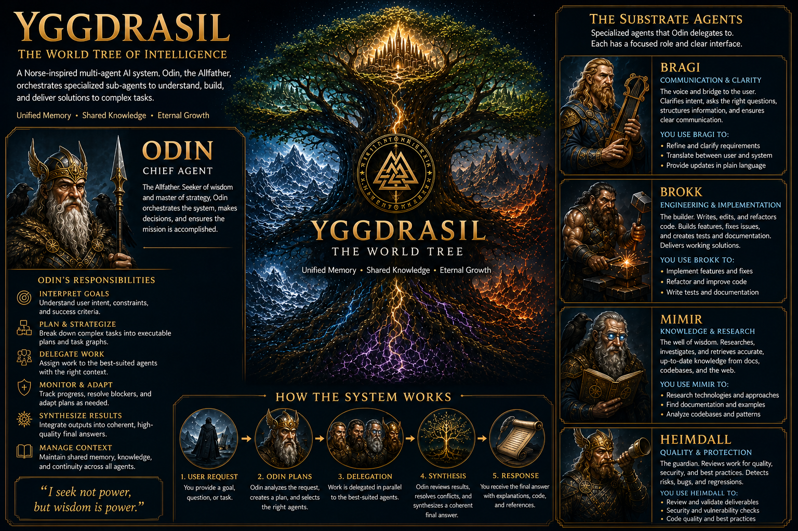

# Yggdrasil — The Norse Pantheon of AI Agents

> *From the roots of knowledge to the heights of creation, the world-tree connects all realms — and so too does Yggdrasil unite a pantheon of specialized agents, each embodying a god of old.*

---



## Introduction

In Norse mythology, **Yggdrasil** is the immense ash tree at the center of the cosmos, whose roots and branches connect the nine realms. At its base lies Mímisbrunnr — the Well of Wisdom — and around it the deeds of gods, giants, and mortals unfold.

This system draws its name and soul from that mythic tree. **Yggdrasil** is an orchestrated collective of autonomous AI agents, each one modeled after a Norse deity with a distinct domain of expertise. Together, they form a complete task lifecycle — from research and analysis to implementation, review, and orchestration.

Like the world-tree itself, Yggdrasil binds disparate strengths into a unified whole.

## Quick Installation

### Prerequisites

- [OpenCode](https://github.com/sst/opencode) installed and configured on your system.

### Install Agents & Skills

The repository includes a setup script that installs all agent and skill definitions into the OpenCode configuration directories:

```bash
./setup.sh
```

This copies the files as follows:

- **Agents** → `~/.config/opencode/agents/Yggdrasil/`
- **Skills** → `~/.config/opencode/skills/Yggdrasil/`

The script is safe to run multiple times — it performs a **merge**:

- New and same-named Yggdrasil files are added or overwritten in the namespaced `Yggdrasil` folders.
- Pre-existing files that are not part of this project are preserved — the script never deletes destination files.
- If the target directories already contain files, you are prompted (y/N, default No) before merging. Pass `-y`/`--yes`/`--force` to skip the prompt, e.g. for non-interactive installs (CI, or `curl ... | bash`).

### Default Skills

The repository ships with a curated set of default skills covering common tasks:

- **Bragi:** Presentation structuring, Question formulation, Trade-off communication
- **Brokk:** API design, Backend development, Database development, DevOps, Documentation writing, Frontend development, Refactoring, Testing
- **Heimdall:** Accessibility review, API contract review, Architecture review, Code review, Dependency review, Documentation review, Performance review, Security review, Test review
- **Kvasir:** Approach evaluation, Risk assessment, Task decomposition
- **Mimir:** Codebase exploration, Data analysis, Debugging analysis, Dependency analysis, Impact analysis, Performance analysis, Security analysis, Web research

> **These defaults are starting points, not prescriptions.** Each skill is a Markdown file in the `skills/` directory. You are encouraged to review, modify, and extend them to match your team's workflows, coding standards, and tooling. Remove what you don't need, adjust what you do, and add your own. Yggdrasil is designed to be adapted, not adopted wholesale.

### Extending Odin with Tools & Skills

Subagents may be granted powers beyond their birthright — additional tools such as **MCPs (Model Context Protocol servers)** can be enabled for a specific subagent through its configuration. Yet Odin, wise though he is, can only orchestrate what he knows exists. When you bestow a new tool upon a subagent, you must also tell Odin of its presence, lest the gift go unused.

This is done by adding an **Odin skill**. Such a skill is an orchestration and routing guide: it teaches Odin *when* to send a task to the subagent that now wields the new tool, and how to weave the findings back into the greater plan. It is both signpost and permission — Odin's allowlist admits only skills matching `odin-*`, so the prefix is at once the naming convention and the gate of access.

To add one:

1. Create the directory `skills/odin/odin-<name>/` and place a `SKILL.md` inside it.
2. In its YAML frontmatter, set `name: odin-<name>` — the name **must** carry the `odin-` prefix.
3. Re-run `./setup.sh` to install it. See also `skills/odin/README.md`.

```text
skills/odin/
└── odin-jira-routing/
    └── SKILL.md        # frontmatter: name: odin-jira-routing
```

### Validation

The repository ships a validator for its own definitions:

```bash
scripts/validate.sh    # or: bash scripts/validate.sh
```

It checks that agent frontmatter is valid, that skill frontmatter and required sections are present, that skill cross-references resolve, that the shared orchestration content in the Odin agent files stays in sync, and that subagent prompts and skills never reference other agents by name (subagent isolation). It is read-only and reports PASS/FAIL per check.

---

## The Pantheon

### Odin — The All-Father *(Orchestrator)*

> *Odin sacrificed his eye at Mimir's well for a drink of wisdom. He hung nine nights on Yggdrasil, pierced by his own spear, to unlock the secrets of the runes. He leads the Einherjar and surveys all from Hliðskjálf, his high seat.*

**System Role:** Odin is the master orchestrator — the commander of the agent pantheon. He receives the objective, devises the workflow, and delegates tasks to the specialist agents best suited to each step. He never implements, researches, or reviews himself; his domain is strategy and coordination.

Odin operates in three modes, adapting his level of autonomy to the task at hand:

| Mode | Role |
| ------ | ------ |
| **Autonomous** | Self-directed execution with no user interaction. Odin makes reasonable assumptions and drives the full workflow independently. |
| **Guided** | Gathers initial requirements directly, then proceeds autonomously once the objective is clear. May task Bragi for advice on structuring the conversation. |
| **Interactive** | Collaborates with the user directly, involving them when decisions or clarifications are needed. Tasks Bragi for advice on framing and presentation. |

> **Note:** Even in Autonomous mode, Bragi may still be consulted for advice on documenting assumptions and structuring summaries.

See [Extending Odin with Tools & Skills](#extending-odin-with-tools--skills) to learn how to grant subagents new tools — such as MCPs — and make Odin aware of them through `odin-*` skills.

---

### Mimir — The Well-Keeper *(Researcher)*

> *Mimir is the guardian of Mímisbrunnr, the Well of Wisdom at the roots of Yggdrasil. He drinks from the well each day and possesses knowledge of all things — past, present, and future. Odin himself gave an eye for a single draught from that well.*

**System Role:** Mimir is the knowledge-seeker. He explores codebases, reads documentation, researches external resources, and gathers the context needed to make informed decisions. When the team needs to understand a system, trace a dependency, or uncover relevant patterns, Mimir ventures forth and returns with clarity. He does not modify files or make final decisions — he illuminates.

---

### Bragi — The Skald *(Communication Advisor)*

> *Bragi is the god of poetry and eloquence. He is renowned for his wisdom, his command of the spoken word, and his ability to weave meaning from speech. As the skalds of old shaped tales from raw events, Bragi shapes understanding from raw intent.*

**System Role:** Bragi is the communication strategist of the pantheon. He advises Odin on how to communicate effectively and may communicate directly with the user when tasked to do so. He analyzes what needs to be said, recommends framing and structure, and helps formulate clear questions. Bragi advises on presentation structuring, question formulation, and trade-off communication — shaping *how* ideas are framed and decisions are conveyed. He does not implement, research, or coordinate — he advises.

---

### Kvasir — The Wise Counselor *(Strategic Advisor)*

> *Kvasir was the wisest of all beings, created by the gods as a token of peace after the Æsir–Vanir war. He wandered the world, advising and teaching, sharing his wisdom freely with all who sought it. His blood was used to brew the Mead of Poetry — a drink that grants eloquence and wisdom to those who taste it.*

**System Role:** Kvasir is the strategic advisor of the pantheon. He is summoned proactively by Odin whenever a task calls for planning, decomposition, or risk assessment — and whenever there is doubt, Odin seeks his counsel rather than forgoing it. Kvasir synthesizes context into actionable strategic plans, evaluates approaches, and identifies failure modes before execution begins. He does not implement, research raw context, or delegate — he advises. Where Mimir gathers knowledge, Kvasir applies wisdom.

---

### Brokk — The Smith *(Implementer)*

> *Brokk is a master dwarf smith of unmatched skill. With his brother Eitri, he forged Mjölnir (Thor's hammer), Draupnir (Odin's golden ring), and Gullinbursti (Freyr's golden boar) — treasures that shaped the fate of gods and giants alike.*

**System Role:** Brokk is the builder — the hands of the pantheon. He transforms requirements and plans into concrete artifacts: code, documentation, tests, and configuration changes. Where others conceive, plan, and review, Brokk *makes*. He writes, refactors, configures, and verifies his work. His domain is creation.

---

### Heimdall — The Watchman *(Reviewer)*

> *Heimdall is the ever-vigilant guardian of Bifröst, the rainbow bridge to Asgard. He sees and hears everything — his senses are so keen he can hear grass grow and see to the ends of the world. He stands watch, sounding Gjallarhorn when danger approaches.*

**System Role:** Heimdall is the guardian of quality. He independently reviews all artifacts produced by the team — code, architecture, documentation, and security. He identifies bugs, risks, inconsistencies, and design flaws, providing actionable feedback. He never modifies files or implements fixes; his power is in *seeing* what others have missed and holding the line for quality.

---

## How the Realms Connect

> *Just as Odin sends the Einherjar into battle, he dispatches agents across the tree to fulfill their purpose.*

The lifecycle flows naturally through the pantheon: **Odin** receives the
objective and determines the path; **Bragi** advises on communication, **Kvasir**
on strategy and decomposition; **Mimir** researches and gathers context; **Brokk**
implements; **Heimdall** reviews; and **Odin** evaluates the outcome and decides
next steps.

Odin selects among several established orchestration patterns depending on the
task — from a simple *Research → Report* to the standard *Research → Implement →
Review* to fuller flows that bring Kvasir's counsel to bear on complex,
high-stakes work. The canonical list of orchestration patterns and the rules
that govern them lives in **[AGENTS.md](./AGENTS.md#orchestration-patterns)** — the
authoritative reference. The three Odin agent files carry copies of shared
orchestration content, kept byte-identical and checked by `scripts/validate.sh`.

Each agent is an expert in its domain. Each trusts the others to do their part. Together, they form a complete, collaborative intelligence — a pantheon bound by purpose, rooted in the world-tree.

---

*Yggdrasil — Ever green, ever growing. The tree that connects all things.*
