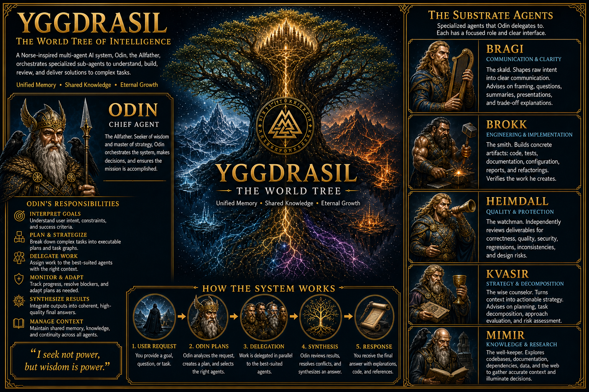

# Yggdrasil — The Norse Pantheon of AI Agents

> *From the roots of knowledge to the heights of creation, the world-tree connects all realms — and so too does Yggdrasil unite a pantheon of specialized agents, each embodying a god of old.*

---



## What Is Yggdrasil?

**Yggdrasil** is a configuration framework for [OpenCode](https://github.com/sst/opencode) that provides a pantheon of six specialized, role-defined AI agents for orchestrated software development. It is not a standalone application — `setup.sh` installs agent definitions, skills, and commands into your OpenCode configuration (`~/.config/opencode/`).

The name is drawn from the immense ash tree of Norse mythology at the center of the cosmos, whose roots and branches connect the nine realms — with the Well of Wisdom, Mímisbrunnr, at its base.

## Why Use It

- **Orchestrated, not single-agent.** A complete task lifecycle — research, strategy, implementation, review — handled by specialists rather than one generalist.
- **Review built in.** Every Brokk (implementer) output is reviewed by Heimdall before it is considered final. No agent reviews its own output.
- **A Final Review Gate** validates the assembled deliverable against your original request before anything reaches you.
- **Persistent project memory.** A source-cited knowledge base (`.yggdrasil-memory/`) persists findings across task lifecycles.
- **Extensible.** Grant custom tools and MCPs to any specialist; add `odin-*` skills. Curated starter skills ship by default and are meant to be adapted.

## The Pantheon

| Agent | Myth-identity | Role | Domain |
| ----- | ------------- | ---- | ------ |
| **Odin** | The All-Father | Orchestrator | Receives the objective, devises the workflow, delegates. Never implements, researches, or reviews directly. |
| **Mimir** | Well-Keeper of Mímisbrunnr | Researcher | Explores codebases, reads docs, gathers context. Illuminates; does not decide or implement. |
| **Bragi** | The Skald | Communicator | Advises on communication strategy, drafts and presents information, provides multi-persona Prompt Council and Deliberation Council for high-stakes decisions. |
| **Kvasir** | The Wise Counselor | Strategic Advisor | Synthesizes context into plans; decomposition, risk, approach. Consulted proactively by Odin. |
| **Brokk** | The Smith | Implementer | Transforms requirements into concrete artifacts: code, docs, tests, config. Has write access. |
| **Heimdall** | The Watchman | Reviewer | Independently validates quality, correctness, completeness. Never implements fixes. |

Odin operates in three modes, adapting his autonomy to the task:

| Mode | Role |
| ------ | ------ |
| **Autonomous** | Self-directed execution with no user interaction. Odin makes reasonable assumptions and drives the full workflow independently. |
| **Guided** | Gathers initial requirements directly, then proceeds autonomously once the objective is clear. May task Bragi for advice on structuring the conversation. |
| **Interactive** | Collaborates with the user directly, involving them when decisions or clarifications are needed. Tasks Bragi for advice on framing and presentation. |

### The Pantheon — in myth

#### Odin — The All-Father

> *Odin sacrificed his eye at Mimir's well for a drink of wisdom. He hung nine nights on Yggdrasil, pierced by his own spear, to unlock the secrets of the runes. He leads the Einherjar and surveys all from Hliðskjálf, his high seat.*

#### Mimir — The Well-Keeper

> *Mimir is the guardian of Mímisbrunnr, the Well of Wisdom at the roots of Yggdrasil. He drinks from the well each day and possesses knowledge of all things — past, present, and future. Odin himself gave an eye for a single draught from that well.*

#### Bragi — The Skald

> *Bragi is the god of poetry and eloquence. He is renowned for his wisdom, his command of the spoken word, and his ability to weave meaning from speech. As the skalds of old shaped tales from raw events, Bragi shapes understanding from raw intent.*

#### Kvasir — The Wise Counselor

> *Kvasir was the wisest of all beings, created by the gods as a token of peace after the Æsir–Vanir war. He wandered the world, advising and teaching, sharing his wisdom freely with all who sought it. His blood was used to brew the Mead of Poetry — a drink that grants eloquence and wisdom to those who taste it.*

#### Brokk — The Smith

> *Brokk is a master dwarf smith of unmatched skill. With his brother Eitri, he forged Mjölnir (Thor's hammer), Draupnir (Odin's golden ring), and Gullinbursti (Freyr's golden boar) — treasures that shaped the fate of gods and giants alike.*

#### Heimdall — The Watchman

> *Heimdall is the ever-vigilant guardian of Bifröst, the rainbow bridge to Asgard. He sees and hears everything — his senses are so keen he can hear grass grow and see to the ends of the world. He stands watch, sounding Gjallarhorn when danger approaches.*

## How It Works

The lifecycle flows through the pantheon: **Odin** receives the objective and determines the path; **Bragi** advises on communication, **Kvasir** on strategy and decomposition; **Mimir** researches and gathers context; **Brokk** implements; **Heimdall** reviews; and **Odin** evaluates the outcome and decides next steps.

Odin selects among several established orchestration patterns depending on the task — from a simple *Research → Report* to the standard *Research → Implement → Review* to fuller flows that bring Kvasir's counsel to bear on complex, high-stakes work. Every plan ends at a Final Review Gate, where Heimdall validates the assembled deliverable against your original request before it reaches you.

Patterns can be combined, repeated, or reordered as the task demands — for example, multiple research → implement → review rounds within a single task.

## Quick Start

1. **Install** — from the repo root:

   ```bash
   ./setup.sh
   ```

   (Use `./setup.sh -y` for non-interactive installs. See [Installation](#installation) for custom paths and upgrades.)

2. **Open a project** — in your terminal, `cd` into any project you want Yggdrasil to work on. OpenCode uses the current directory as its session workspace. Restart OpenCode (or start a new session) and the six agents appear in your agent selector.

3. **Switch to Odin and make a request.** For example, switch to the **Odin (Interactive)** agent and say:

   > *"Refactor the authentication middleware in this project. Start by researching the current structure, then propose an approach before implementing."*

   This exercises the full lifecycle: research → advise → implement → review. Odin also runs in Guided or Autonomous mode — see [The Pantheon](#the-pantheon).

## Installation

### Prerequisites

- [OpenCode](https://github.com/sst/opencode) installed and configured (requires `~/.config/opencode/`).

### Install

```bash
./setup.sh
```

You'll be prompted for two choices: whether to copy the curated optional skills (default: yes), and whether to merge into existing target directories (default: skip; the script merges safely — same-named Yggdrasil files overwritten, new files added, unrelated files preserved, nothing deleted). Pass `-y` to skip both prompts for CI or `curl ... | bash` installs.

**What gets installed:**

- **Agents** → `~/.config/opencode/agents/yggdrasil/`
- **Commands** → `~/.config/opencode/commands/yggdrasil/`
- **Capability generator** → `~/.config/opencode/yggdrasil/generate-capabilities.sh`
- **Custom-capabilities scaffold** → `~/.config/opencode/yggdrasil/custom-capabilities.yaml` (first install only; never overwritten on upgrades)
- **Capability inventory** → `~/.config/opencode/skills/yggdrasil/shared/capability-inventory/SKILL.md` (regenerated automatically on every install)

**Skills installed:**

Required (always installed, regardless of the prompt — Odin's council and memory mechanisms depend on them):

- **Prompt Council skills** (the five `bragi-council-prompt-*` persona skills) → `~/.config/opencode/skills/yggdrasil/bragi/council-prompt/`
- **Deliberation Council skills** (the five `bragi-council-deliberation-*` perspective skills) → `~/.config/opencode/skills/yggdrasil/bragi/council-deliberation/`
- **Memory system skill** (`odin-memory-system`) → `~/.config/opencode/skills/yggdrasil/odin/memory/`
- **Memory curation skill** (`brokk-memory-curation`) → `~/.config/opencode/skills/yggdrasil/brokk/memory/`

Optional (the curated starter skills, installed only if accepted at the prompt):

- **Optional skills** → `~/.config/opencode/skills/yggdrasil/<agent>/` subdirectories (see [Optional Skills](#optional-skills) below)

### Advanced installation

#### Custom Installation Path

By default, everything installs to `~/.config/opencode/`. To use a different location, set `OPENCODE_CONFIG_BASE` as an environment variable or use the `-c`/`--config-base` CLI flag:

```bash
# Environment variable
OPENCODE_CONFIG_BASE=/custom/path ./setup.sh -y

# CLI flag (takes precedence)
./setup.sh -c /custom/path -y
```

The path supports `~` expansion (e.g., `~/my-opencode-config`).

#### Upgrades

Re-running `./setup.sh` after pulling the latest framework updates performs a safe upgrade:

- **Agent files** that have been locally modified are backed up with a timestamp suffix (e.g., `odin-autonomous.md.bak.1234567890`) before being overwritten. Review your backup to recover any custom permission grants and re-apply them to the new version.
- **Skill files** are overwritten if they match the current version; they're never backed up.
- **Custom-capabilities.yaml** is never touched — your custom tool grants are always preserved.
- **Capability inventory** is always regenerated to reflect framework updates and any custom capabilities you've added.

#### Optional Skills

Yggdrasil ships with a curated set of optional skills. **These are starting points, not prescriptions** — each is a Markdown file installed into the respective agent subdirectory under the installed `skills/yggdrasil/` tree (e.g., `skills/yggdrasil/brokk/`, `skills/yggdrasil/mimir/`). Review, modify, and extend them to match your team's workflows. Remove what you don't need, adjust what you do, and add your own. (Installed only if you accept the "Copy optional skills?" prompt at install time.)

- **Bragi:** Presentation structuring, Question formulation, Trade-off communication
- **Brokk:** API design, Backend development, Database development, DevOps, Documentation writing, Frontend development, Git, Refactoring, Testing
- **Heimdall:** Accessibility review, API contract review, Architecture review, Code review, Dependency review, Documentation review, Performance review, Security review, Test review
- **Kvasir:** Approach evaluation, Research decomposition, Risk assessment, Task decomposition
- **Mimir:** Codebase exploration, Data analysis, Debugging analysis, Dependency analysis, Impact analysis, Performance analysis, Security analysis, Web research
- **Odin:** Research convention

## Commands

Commands are **macros for user requests to Odin** — equivalent to stating the same request in natural language. Natural-language invocation remains fully valid; commands are shortcuts, not the only door. This ensures commands always flow through the full orchestration pipeline with proper review gates — never bypassing specialist review.

Yggdrasil provides five globally-installed slash-commands, available in every project once installed:

- **`/yggdrasil/deliberate <question>`** — Run the Deliberation Council: five perspective lenses analyze the question in parallel, Kvasir synthesizes the competing arguments, and Bragi delivers the reasoned conclusion. Multi-dispatch and deliverable-producing (7 specialist dispatches plus the Final Review Gate); expect to wait.
- **`/yggdrasil/research <topic>`** — Decompose the topic via Kvasir, surface the plan as a steering checkpoint, then run parallel research streams with independent review, synthesis, and a Bragi-delivered report. Adaptive and multi-dispatch (minimum ~7, typical ~11, may reach ~21 for genuinely multi-faceted topics); expect to wait.
- **`/yggdrasil/remember [topic]`** — Promote reviewed findings to the project knowledge base. Runs the reviewed promotion pipeline (orchestrated, not an instant write). The only way promotion is initiated; never automatic at task wrap-up.
- **`/yggdrasil/dream [scope]`** — Consolidate and audit the knowledge base for duplicates, contradictions, and staleness. Orchestrated maintenance; may prune by judgment but never silently performs a forget.
- **`/yggdrasil/forget <scope>`** — Delete entries from the knowledge base. Destructive and always confirmed before dispatch; invocation is intent, not confirmation. Working-tree only; full wipe requires a second confirmation.

Each command routes through the full orchestration pipeline — reviewed at every stage, never an instant or unreviewed write.

## Memory System

Yggdrasil maintains a **persistent knowledge base** at `.yggdrasil-memory/` **rooted at the current working directory of the session** (per project) — recommended to be git-tracked — distinct from the transient, gitignored `.yggdrasil-workspace/` task artifact workspace.

**What it contains:** verified facts with file/line citations, decisions and rationale, and hard-won findings (root causes, dependency quirks, performance characteristics). Not task narratives, review verdicts, transient state, or anything reproducible in seconds by reading one file.

Memory is maintained through the three [commands](#commands) above, each routed through the full reviewed orchestration pipeline — never an instant, unreviewed write. If a project has no `.yggdrasil-memory/` directory, the commands offer to establish it (scaffolded from canonical templates in the `brokk-memory-curation` skill). By default the knowledge base is git-tracked, so git history provides an audit trail and a recovery net for destructive operations.

The full memory convention — promotion pipeline, dream consolidation, forget deletion, and the Recall mechanism — is governed by the same orchestration rules that shape every task: every write is reviewed, every deletion is confirmed, and nothing enters memory without a vetted pipeline. The orchestration doctrine for the three command-triggered operations lives in the **[`skills/odin/odin-memory-system/SKILL.md`](./skills/odin/odin-memory-system/SKILL.md)** skill; the canonical entry-schema template lives in **[`skills/brokk/brokk-memory-curation/SKILL.md`](./skills/brokk/brokk-memory-curation/SKILL.md)**.

## Extending Yggdrasil with Tools & Skills

The repo is only needed for the initial install and framework upgrades. Once installed, all extension happens in the installed location, via two paths that end in the same regeneration step: **add a new skill** to a specialist (a Markdown file), or **grant a new tool** to a specialist (a permission + registry entry). Both feed the same generator and surface in the same capability inventory.

### Add a New Skill to a Specialist

Specialist skills (Mimir, Brokk, Heimdall, Kvasir, Bragi) are plain Markdown files discovered from the installed skills tree — no agent definition edits are needed; each specialist's permission allowlist already admits any skill matching its own prefix (e.g., `brokk-*`). Unlike Odin's skills (see [`skills/odin/README.md`](skills/odin/README.md)), they are **not** picked up by planning automatically: after adding one, you must regenerate the capability inventory, or Odin and Kvasir will not know it exists.

1. **Create the skill file** in the installed skills tree:

   ```bash
   $CONFIG_BASE/skills/yggdrasil/<agent>/<agent>-<name>/SKILL.md
   ```

   Always-on skills install to a feature subdirectory: `<agent>/<feature>/<agent>-<name>/SKILL.md` (e.g., `bragi/council-prompt/bragi-council-prompt-empath/`, `brokk/memory/brokk-memory-curation/`). Optional skills always install flat at `<agent>/<agent>-<name>/`.

   where `<agent>` is one of `mimir`, `brokk`, `heimdall`, `kvasir`, `bragi`. The frontmatter requires `name` (must exactly match the directory name) and a one-line `description` phrased by role — never naming any agent:

   ```yaml
   ---
   name: <agent>-<name>
   description: <one-line, agent-neutral description>
   ---
   ```

   The body follows the same five sections as every shipped skill, in this order: `## Purpose`, `## When to Use`, `## Workflow`, `## Quality Criteria`, `## Anti-Patterns`.

2. **Regenerate the capability mirror**:

   ```bash
   $CONFIG_BASE/yggdrasil/generate-capabilities.sh
   ```

   This harvests the new skill's frontmatter into `$CONFIG_BASE/skills/yggdrasil/shared/capability-inventory/SKILL.md`, making it visible to Odin and Kvasir. **This step is required and nothing checks it for you** — a skill added without regeneration is invisible to planning. (`setup.sh` reruns the generator on every install and upgrade, so fresh installs are always current.)

For example, `$CONFIG_BASE/skills/yggdrasil/brokk/brokk-shell-scripting/SKILL.md` (frontmatter `name: brokk-shell-scripting`) appears in the inventory under **implementer** as `shell-scripting` after regeneration.

### Grant a New Tool to a Specialist

1. **Grant the tool** in the installed agent definition file:

   ```bash
   $CONFIG_BASE/agents/yggdrasil/<agent-name>.md
   ```

   Add the tool to the agent's `permission:` block (e.g., a new MCP or locally-available executable).

2. **Register the capability** in the installed custom-capabilities file:

   ```bash
   $CONFIG_BASE/yggdrasil/custom-capabilities.yaml
   ```

   ```yaml
   custom_capabilities:
     - name: <capability-slug>
       role: <researcher|implementer|reviewer|strategist|communicator>
       summary: <one-line, role-phrased description>
   ```

3. **Regenerate the capability mirror**:

   ```bash
   $CONFIG_BASE/yggdrasil/generate-capabilities.sh
   ```

   This updates `$CONFIG_BASE/skills/yggdrasil/shared/capability-inventory/SKILL.md`, making the new capability visible to both Odin and Kvasir immediately.

### Built-In Capability Inventory

Both Odin and Kvasir maintain awareness of all available capabilities — built-in skills plus custom-granted tools — by independently loading the same **`capability-inventory` skill** at the start of task execution/planning. No relay, copying, or curation needed — both agents load the same source directly via name-based discovery.

The inventory is assembled from two sources: **built-in skills** (harvested automatically from agent and skill frontmatter) and **custom capabilities** (read from `custom-capabilities.yaml`). The generator is created at install time and can be re-run after adding custom tools. Custom tool grants are managed post-install in `$CONFIG_BASE/yggdrasil/custom-capabilities.yaml` and `$CONFIG_BASE/agents/yggdrasil/`, never in the repo.

### Prompt Council

Odin's shared body includes an optional **Prompt Council** — a trigger-gated pattern for reformulating ambiguous or high-stakes prompts before execution begins. When a prompt is *both* genuinely ambiguous *and* expensive to misinterpret (high-stakes, security-sensitive, or costly to redo), Odin may dispatch N (default 5) communication-specialist instances in parallel, each adopting one committed persona lens:

- **Clarifier** (`bragi-council-prompt-clarifier`) — precision lens, surface vague terms and pin referents.
- **Completer** (`bragi-council-prompt-completer`) — coverage lens, surface missing requirements and implicit assumptions.
- **Empath** (`bragi-council-prompt-empath`) — user-intent lens, reconstruct the goal behind the literal words.
- **Adversary** (`bragi-council-prompt-adversary`) — risk lens, surface edge cases, failure scenarios, and load-bearing assumptions.
- **Constraint** (`bragi-council-prompt-constraint`) — boundaries lens, surface scope limits, non-goals, and invariants.

A fresh-session synthesizer then merges the five reformulations into one enriched prompt (merging, not forcing consensus — the personas are complementary, not convergent). The enriched prompt feeds the normal pipeline. If synthesis reports low confidence, the original prompt is genuinely ambiguous and Odin escalates per the mode's Communication Policy rather than re-running the Prompt Council.

The Prompt Council is capped at **K=1** (one round, no iterative revision), costs N + 1 specialist dispatches, and is advisory output — no independent Heimdall review; defects surface through Failed Review Classification and the Final Review Gate. Trigger discipline is the safeguard against cost creep: the Prompt Council runs only on high-stakes *and* ambiguous prompts — routine, clear, or low-stakes prompts proceed directly into the normal pipeline.

### Deliberation Council

Odin's shared body also includes an optional **Deliberation Council** — a trigger-gated mechanism that generates diverse perspectives on a question, synthesizes them into a reasoned conclusion, and communicates it as a deliverable. Distinct from the Prompt Council (advisory input-processing), it sits alongside "Research → Review → Report" as a deliverable-producing execution pattern, not inside the advisory Consultation Layer.

**Mechanism — a 5-stage pipeline:**

1. **Research gate (conditional Stage 0).** Odin assesses whether the question requires factual substrate the lenses cannot self-provide (Bragi lacks research skills). When in doubt, err toward research. User override is available; if triggered, the user is told with cost. If needed, **Odin decides the approach** before dispatching:
   - **Single Mimir session** — bounded question, one pass (the common case).
   - **Multiple Mimir sessions** — distinct factual areas, dispatched in parallel and merged into one substrate.
   - **Research mechanism** — broad question warranting full Kvasir decomposition; use that mechanism instead.

   Each substrate must be **fact-rich and framing-poor** ("what is the case?", not "what does it mean?") and begins with a **scope-declaration preamble** (what was investigated, what was out-of-scope, and why). If research is not needed (conceptual/values/framing questions), skip this step.
2. Dispatch **N (default 5) Bragi tasks** in parallel, each adopting one perspective lens from the `bragi-council-deliberation-*` skills, the question, and any available context:
   - **Foundations** (`bragi-council-deliberation-foundations`) — first-principles lens, strip away convention.
   - **Systems** (`bragi-council-deliberation-systems`) — systems-thinking lens, map relationships and feedback loops.
   - **Adversary** (`bragi-council-deliberation-adversary`) — adversarial lens, construct the strongest case against.
   - **Pragmatist** (`bragi-council-deliberation-pragmatist`) — pragmatist lens, test against concrete constraints.
   - **Humanist** (`bragi-council-deliberation-humanist`) — humanist lens, who is affected and what they value.
   If a substrate was produced, each lens receives it as input context alongside the question. Each lens must **argue its case fully without seeking consensus** — convergence is the synthesizer's job.
3. Dispatch one **Kvasir** task to synthesize: read all N perspective artifacts, weigh the competing arguments, and reach a reasoned conclusion written to a synthesis artifact. Kvasir is informed whether a shared research prior was used. Kvasir's synthesis is an intermediate artifact — Bragi stands between Kvasir and the user, preserving Kvasir's advisory boundary.
4. Dispatch one fresh-session **Bragi** task to draft the final user-facing answer from Kvasir's synthesis artifact. The deliverable states whether research was performed.
5. **Final Review Gate** — a fresh Heimdall session validates the assembled deliverable.

**Triggering (mode-specific):**

- In **Interactive** mode: the `/deliberate` command fires it immediately; explicit multi-perspective/opinions/angles language in the request fires it; an opinion-type question without explicit multi-perspective language prompts a suggest-then-confirm, letting the user choose; factual or executable requests skip it.
- In **Guided** mode: explicit multi-perspective/opinions/angles language in the request fires it; an opinion-type question without explicit multi-perspective language prompts a suggest-then-confirm, letting the user choose; factual or executable requests skip it. (The `/deliberate` command is unavailable — it targets Interactive mode only.)
- In **Autonomous** mode: explicit multi-perspective/deliberation language fires it; opinion-type language without an explicit request skips it (suggest-then-confirm requires interaction, which contradicts the autonomous Communication Policy); no opinion-type language skips it.

**Constraints:** K=1 (one round, no iteration). N=5 (all perspectives fire by default). Cost without research: N + 2 (7 at N=5) plus the Final Review Gate. Cost with research: N + 3 (8 at N=5) plus the Final Review Gate, scaling with parallel Mimir sessions. Output is a deliverable — it must pass the Final Review Gate.

**Relationship to the Prompt Council:** The two mechanisms are composable. If both fire (ambiguous *and* high-stakes prompt, plus a multi-perspective question), the Prompt Council runs first as input-processing, then the Deliberation Council fires on the refined prompt.

### Research

Odin's shared body also includes a **Research mechanism** — a trigger-gated, deliverable-producing execution pattern that orchestrates heavy research tasks through strategic decomposition and parallelized investigation. Like the Deliberation Council, it produces a user-facing deliverable (not advisory output) and routes through the Final Review Gate. Two distinctions set it apart: it is **adaptive** — the number of research streams N is determined by Kvasir's one-shot decomposition of the topic, not fixed at a default — and it is the only mechanism with a **mandatory user-visible steering checkpoint** between planning and execution, which is what makes the mandatory Kvasir consultation additive rather than redundant.

**Mechanism — an 8-step arc:**

1. Dispatch one **Kvasir** task with the `kvasir-research-decomposition` skill to decompose the research question into independent research clusters. The decomposition plan is written to a plan artifact. Kvasir is advisory here (Reading A) — no independent Heimdall review of the decomposition itself.
2. **Plan checkpoint** — surface the decomposition plan to the user as a steering checkpoint before committing to execution; pause for redirect. This is the key innovation: the mandatory Kvasir consultation is additive because the plan is visible and steerable, not a hidden internal step.
3. Dispatch **N parallel Mimir research streams** — one per cluster from the decomposition — each grounding its investigation in live sources per the `odin-research-convention` skill and writing a `NN-research-cluster-<name>.md` artifact. Parallelism is emergent from the decomposition (independent clusters run in parallel), not enforced where clusters depend on each other.
4. Dispatch **N parallel fresh-session Heimdall reviews** — one per Mimir artifact — each writing a `NN-review-cluster-<name>.md` artifact.
5. Dispatch one **synthesis** task: read all reviewed cluster artifacts and organize the findings around the original question, **naming its own boundaries** — what was covered, what was not, and what remains uncertain — in a synthesis artifact.
6. Dispatch one **Heimdall** task to review the synthesis.
7. Dispatch one fresh-session **Bragi** task to draft the final user-facing deliverable from the reviewed synthesis. Bragi stands between the synthesis and the user, preserving Kvasir's advisory boundary.
8. Route the assembled deliverable through the **Final Review Gate** (a fresh Heimdall session) validating it against the original request.

**Triggering (mode-specific):**

- In **Interactive** mode: the `/research` command fires it immediately; explicit research/investigate/analyze-into language in the request fires it; factual or executable requests skip it.
- In **Guided** mode: explicit research/investigate/analyze-into language in the request fires it; factual or executable requests skip it. (The `/research` command is unavailable — it targets Interactive mode only.)
- In **Autonomous** mode: explicit research/investigate/analyze-into language in the prompt fires it (the plan checkpoint auto-proceeds; the decomposition still runs); no research-type language skips it. (Suggest-then-confirm is unavailable — it requires interaction, which contradicts the autonomous Communication Policy.)

**Constraints:** K=1 (one decomposition pass, no re-decomposition loop — iteration is handled internally by the `kvasir-research-decomposition` skill's batching/waves). N is the cluster count from Kvasir's decomposition (adaptive; no fixed default — typically 1 for light questions, 2-5 for heavy research). Cost: `2N + 5` dispatches (7 at N=1, 11 at N=3, 21 at N=8) plus the Final Review Gate. The Research mechanism's output is a deliverable, not advisory — it must pass the Final Review Gate.

**Relationship to other mechanisms:** Composable with the Prompt Council: if the topic prompt is ambiguous and high-stakes, the Prompt Council runs first as input-processing, then the Research mechanism fires on the refined prompt (same composability as the Deliberation Council). Kvasir's decomposition (step 1) is advisory and does not receive independent Heimdall review (Consultation Layer doctrine) — but unlike the ordinary Consultation Check, the consultation here is mandatory, not trigger-gated; the steering checkpoint (step 2) is what makes that mandatory consultation additive. Sibling to the Deliberation Council — both are deliverable-producing execution patterns in the shared orchestration body. The Final Review Gate applies as normal.

## Development

```bash
scripts/validate.sh    # or: bash scripts/validate.sh
```

The validator is read-only and reports PASS/FAIL per check. It verifies that agent frontmatter parses, that skill frontmatter and required sections are present, that the shared orchestration content in the Odin agent files stays byte-identical to regenerated output, and that subagent prompts and skills never reference other agents by name (subagent isolation).

To test a change to an agent or skill: edit the source file, run `scripts/validate.sh`, and (for Odin files) regenerate via `scripts/generate-odin-agents.sh` before committing.

---

*Yggdrasil — Ever green, ever growing. The tree that connects all things.*
