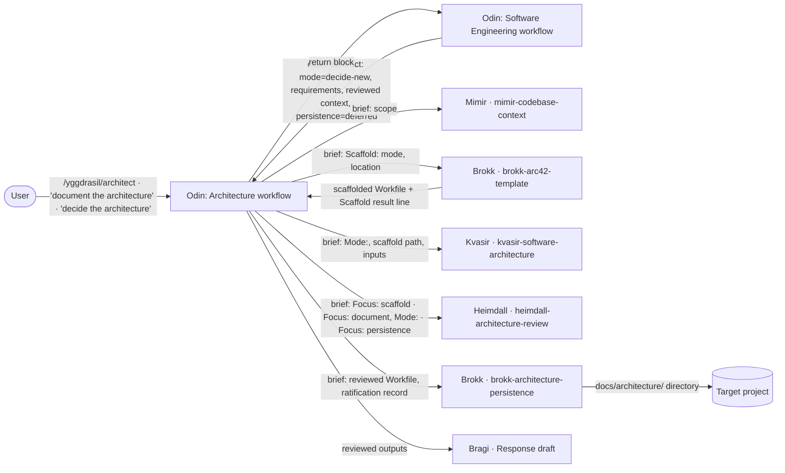

# 3. Context and Scope

_Part of [Architecture Workflow (Yggdrasil) — Architecture (arc42)](README.md)._

## 3.1 Business Context

| Partner | Input to the workflow | Output from the workflow |
| --- | --- | --- |
| User | Command/trigger, optional mode direction, optional location | Response; persisted directory (Artifact) |
| Engineering workflow | Caller contract (§5.1.1 I-1) | Return block (§5.1.1 I-2) |
| Mimir / Brokk (scaffold) / Kvasir / Heimdall / Brokk (persistence) / Bragi | Briefs with the `Mode:` line; the scaffold path for Kvasir | Scaffold result line, Workfiles, verdicts, persistence manifest |

## 3.2 Technical Context

_Omitted — all exchanges are markdown briefs and Workfiles in `.yggdrasil-workspace/`; no channel changes._
