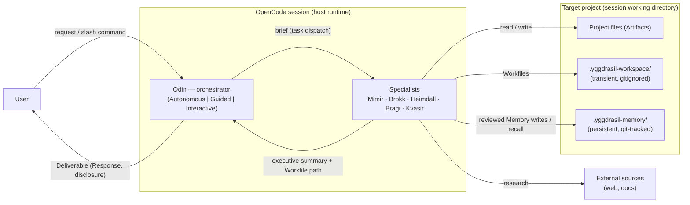

# 3. Context and Scope

_Part of [Yggdrasil — Architecture (arc42)](../README.md) · [§3](README.md)._

## 3.1 Business Context

Yggdrasil sits between a human user and a target software project, inside an OpenCode session. The user speaks to Odin; Odin speaks to specialists; specialists read and write the target project, the Workspace, and Memory; Heimdall's verdicts gate what returns to the user.

| Communication partner | Input to Yggdrasil | Output from Yggdrasil | Evidence |
| --- | --- | --- | --- |
| **User** | Natural-language prompt; `/yggdrasil/{research,architect,engineer,deliberate,remember,dream,forget}` with `$ARGUMENTS`; checkpoint decisions (mode-dependent) | Response carried in Odin's final message, with disclosure of assumptions and blockers; Artifacts in the project | `agents/odin-autonomous.md:70-72, 280-302`; `commands/yggdrasil/research.md:1-13`; directory listing of `commands/yggdrasil/` |
| **Target project** | Codebase and documentation read by Mimir, Heimdall, Kvasir, Brokk | Artifacts written by Brokk; `.gitignore` entry for the workspace ensured by Brokk | `agents/brokk.md:53-56, 75, 90` |
| **External sources** | Web search and fetch results consumed by Mimir | — | `agents/mimir.md:67-68` (`webfetch`, `websearch` allowed) |
| **OpenCode configuration home** | Installed agents, commands, skills, capability inventory, custom capability grants | — | `README.md:108-136` |

## 3.2 Technical Context

Every channel in the system is an OpenCode tool call or a file in the session working directory. The tool surface each role may touch is declared in its frontmatter and is the technical interface between Yggdrasil and its host.

| Channel | Mechanism | Who uses it | Evidence |
| --- | --- | --- | --- |
| **Agent dispatch** | OpenCode `task` tool; Odin may task exactly `bragi`, `brokk`, `heimdall`, `kvasir`, `mimir`; no subagent frontmatter grants `task` | Odin → specialists | `agents/odin-autonomous.md:12-18`; `agents/mimir.md:6-68` (no `task` key); `agents/brokk.md:6-64` (no `task` key) |
| **Session resume** | `task_id` of a prior subagent session passed on re-dispatch | Odin | `agents/odin-autonomous.md:92-102` |
| **Skill loading** | OpenCode `skill` tool with a prefix allowlist per role: Odin `capability-inventory` + `odin-*`; Mimir `mimir-*`; Brokk `brokk-*`; and likewise for the other roles | All agents | `agents/odin-autonomous.md:8-11`; `agents/mimir.md:63-65`; `agents/brokk.md:61-63` |
| **Command dispatch** | OpenCode command file with frontmatter `description`, `agent`, `subtask: false` and a body carrying `$ARGUMENTS` plus a skill-load directive | User → Odin (named mode) | `commands/yggdrasil/research.md:1-13` |
| **File I/O** | `read`, `glob`, `grep`, `lsp` broadly allowed to subagents; `edit` scoped by glob — Mimir/Kvasir/Heimdall/Bragi to `.yggdrasil-workspace/**/*.md` only, Brokk to everything except `.yggdrasil-workspace/**`; Odin has no file tools at all | Subagents | `agents/mimir.md:55-62`; `agents/brokk.md:53-60`; `agents/odin-autonomous.md:6-19` |
| **Shell** | `bash` with per-command glob allow/deny lists: inspection-only for Mimir, broad for Brokk with history-rewriting and chained-git patterns denied | Mimir, Brokk, Heimdall, Kvasir | `agents/mimir.md:8-54`; `agents/brokk.md:8-52` |
| **Filesystem stores** | `.yggdrasil-workspace/<task-dir>/NN-<topic>.md` (transient) and `.yggdrasil-memory/<topic>.md` + `INDEX.md` (persistent) | All agents per role | `agents/odin-autonomous.md:74-90` |
