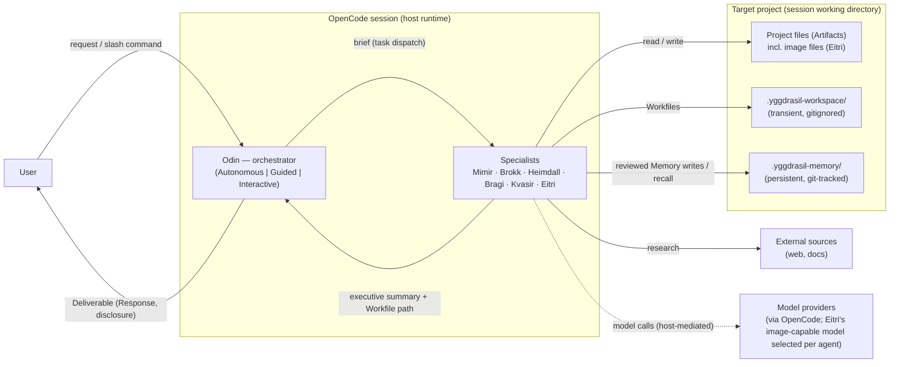

# 3. Context and Scope

_Part of [Yggdrasil — Architecture (arc42)](../README.md) · [§3](README.md)._

## 3.1 Business Context

Yggdrasil sits between a human user and a target software project, inside an OpenCode session. The user speaks to Odin; Odin speaks to specialists; specialists read and write the target project, the Workspace, and Memory; Heimdall's verdicts gate what returns to the user. This revision adds a sixth specialist, Eitri, whose Artifacts are image files written into the target project at the path the brief names, and whose reasoning model may differ from the pantheon's default.

| Communication partner | Input to Yggdrasil | Output from Yggdrasil | Evidence |
| --- | --- | --- | --- |
| **User** | Natural-language prompt — after this revision including requests for visual assets; `/yggdrasil/{research,architect,engineer,deliberate,remember,dream,forget}` with `$ARGUMENTS`; checkpoint decisions (mode-dependent) | Response carried in Odin's final message; Artifacts in the project, including image files at user-directed paths | `agents/odin-autonomous.md:70-72, 280-302`; `commands/yggdrasil/research.md:1-13`; `01-requirements.md` US-1 |
| **Target project** | Codebase and documentation read by Mimir, Heimdall, Kvasir, Brokk, and (reference assets, style guides, design tokens) Eitri | Artifacts written by Brokk; image Artifacts written by Eitri; `.gitignore` entry for the workspace ensured by Brokk | `agents/brokk.md:53-56, 75, 90`; ADR-0010 |
| **External sources** | Web search and fetch results consumed by Mimir (Eitri has no network tools) | — | `agents/mimir.md:67-68`; ADR-0010 |
| **Model providers (via OpenCode)** | Model responses; for Eitri, the responses of the image-capable model named by his `model:` field or its install-site override | Prompts, including Eitri's image briefs | ADR-0009; `README.md:103` (OpenCode configured with providers is a prerequisite) |
| **OpenCode configuration home** | Installed agents, commands, skills, capability inventory, custom capability grants; after this revision also the operator's `opencode.json` agent-model override for Eitri | — | `README.md:113-141`; ADR-0009 |

## 3.2 Technical Context

Every channel in the system is an OpenCode tool call or a file in the session working directory. The tool surface each role may touch is declared in its frontmatter and is the technical interface between Yggdrasil and its host.

| Channel | Mechanism | Who uses it | Evidence |
| --- | --- | --- | --- |
| **Agent dispatch** | OpenCode `task` tool; Odin may task exactly `bragi`, `brokk`, `eitri`, `heimdall`, `kvasir`, `mimir`; no subagent frontmatter grants `task` | Odin → specialists | `scripts/odin-generator/preamble.template.md:12-18` (revised by WP-2); `agents/mimir.md:6-68` (no `task` key) |
| **Per-agent model selection** | OpenCode per-agent model override in the configuration home's `opencode.json` (`agent.eitri.model`); **no agent file in the repository carries a `model:` key** — Eitri's was withdrawn by user direction after implementation (ADR-0009 amendment) | Operator (install-site override only) | ADR-0009 (amended); `scripts/subagent-generator/eitri.template.md:1-25`; `agents/mimir.md:1-5` and peers (no `model:` field) |
| **Session resume** | `task_id` of a prior subagent session passed on re-dispatch | Odin | `agents/odin-autonomous.md:92-102` |
| **Skill loading** | OpenCode `skill` tool with a prefix allowlist per role: Odin `capability-inventory` + `odin-*`; Mimir `mimir-*`; Brokk `brokk-*`; Eitri `eitri-*`; and likewise for the other roles | All agents | `agents/odin-autonomous.md:8-11`; `agents/mimir.md:63-65`; ADR-0010 |
| **Command dispatch** | OpenCode command file with frontmatter `description`, `agent`, `subtask: false` and a body carrying `$ARGUMENTS` plus a skill-load directive | User → Odin (named mode) | `commands/yggdrasil/research.md:1-13` |
| **File I/O** | `read`, `glob`, `grep`, `lsp` broadly allowed to subagents; `edit` scoped by glob — Mimir/Kvasir/Heimdall/Bragi to `.yggdrasil-workspace/**/*.md` only; Brokk to everything except `.yggdrasil-workspace/**`; **Eitri to `.yggdrasil-workspace/**/*.md` plus image-file globs anywhere** (Memory protected by construction, as for the other markdown writers — no agent carries a Memory deny glob); Odin has no file tools at all | Subagents | `agents/mimir.md:55-62`; `agents/brokk.md:53-60`; `agents/odin-autonomous.md:6-19`; `scripts/subagent-generator/eitri.template.md:8-17`; ADR-0010 (amended) |
| **Shell** | `bash` with per-command glob allow/deny lists: inspection-only for Mimir, Heimdall, Kvasir; broad for Brokk; **none for Bragi and Eitri** | Mimir, Brokk, Heimdall, Kvasir | `agents/mimir.md:8-54`; `agents/brokk.md:8-52`; `scripts/subagent-generator/bragi.template.md:6-18`; ADR-0010 |
| **Filesystem stores** | `.yggdrasil-workspace/<task-dir>/NN-<topic>.md` (transient; Eitri's image manifests live here) and `.yggdrasil-memory/<topic>.md` + `INDEX.md` (persistent) | All agents per role | `agents/odin-autonomous.md:74-90`; §5.1.2 (Eitri output contract) |
