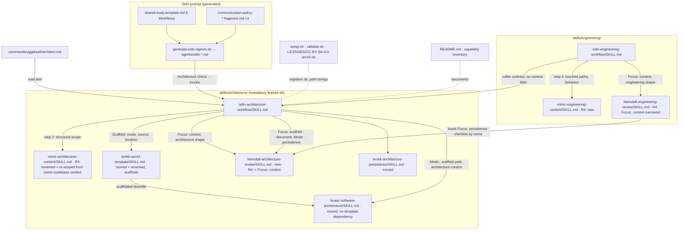

# 5. Building Block View

_Part of [Architecture Workflow (Yggdrasil) — Architecture (arc42)](README.md)._

## 5.1 Whitebox Overall System



Motivation: one feature directory per workflow family, each holding its Odin doctrine skill plus the specialists that serve it (the convention `research/`, `deliberation/`, `engineering/` already follow — context research §6). Every skill the Architecture workflow dispatches lives in `skills/architecture/`; `engineering/` holds only engineering-specific skills and reaches the architecture family by name (C-11). Revision 4 completes the separation for context gathering: each family has its own Mimir skill, scoped to what its consumers read, and the engineering workflow no longer dispatches any skill from the architecture directory except by loading `odin-architecture-workflow` itself. The arc42 skeleton is Brokk's: Brokk instantiates it (scaffold) and Brokk persists it; Kvasir only fills it.

| Building block | Responsibility | Changed by this objective? |
| --- | --- | --- |
| 5.1.1 `odin-architecture-workflow` | Orchestration doctrine for both modes; caller contract; scaffold step; review gates; persistence; Response | **New** (`skills/architecture/`) |
| 5.1.2 `commands/yggdrasil/architect.md` | Slash command → load the workflow skill | **New** |
| 5.1.3 Odin prompt templates | `§ Workflows` entry, trigger rules, Communication Policy thresholds | Modified |
| 5.1.4 `kvasir-software-architecture` | Dual-mode arc42 drafting into a pre-scaffolded Workfile; no template dependency | Modified; **moved** to `skills/architecture/` |
| 5.1.5 `heimdall-architecture-review` | Architecture-context review (R4), scaffold review, architecture-document review (both modes), persisted-directory review | **New** (`skills/architecture/`); R4: gains `Focus: context`; `heimdall-engineering-review` `Focus: context` narrowed to the engineering shape |
| 5.1.6 `odin-engineering-workflow` | Delegates architecture to 5.1.1; R4: engineering context step moves after the delegation (step 4), dispatches `mimir-engineering-context`; caller contract loses `context=` | Modified (R4 again) |
| 5.1.7 `brokk-architecture-persistence` | Persist reviewed Workfile | Consumed; **moved** to `skills/architecture/`; wording fixes since delivery |
| 5.1.8 `mimir-architecture-context` (was `mimir-codebase-context`) | Structural facts for §5/§6/§8 and as-is documentation: boundaries, entry points, boundary interfaces, embodied cross-cutting concepts, existing architecture documentation, current-state view | **R4: renamed + re-scoped in place** (`skills/architecture/`); discipline text retained; behavior/conventions/test-infrastructure sections removed |
| 5.1.9 `README.md`, capability inventory | Document workflow; fix stale list; document new directory; regenerate | Modified / regenerated (R4: two Mimir slugs) |
| 5.1.10 Installer, validator, license notice | Register `architecture` as mandatory; clean relocated deployed copies; update template slug/path | Modified (R4: cleanup gains `architecture/mimir-codebase-context`) |
| 5.1.11 `brokk-arc42-template` (was `kvasir-arc42-template`) | Own the arc42 skeleton; scaffold it into the Workfile with header, shape detection, next ADR number, attribution | **Renamed + moved** to `skills/architecture/`; Purpose/When to Use/Workflow rewritten as scaffolding behavior; § Skeleton payload unchanged |
| 5.1.12 `mimir-engineering-context` | Behavioral facts for acceptance criteria and TDD: current behavior of touched paths, engineering conventions, test infrastructure with an executed baseline, interfaces the tests will call | **R4: new** (`skills/engineering/`); discipline text duplicated from 5.1.8 |

### 5.1.1 Blackbox `odin-architecture-workflow`

- **Purpose / responsibility:** the single source of doctrine for architecture work: mode selection, conditional architecture-context gate, scaffold, Kvasir drafting dispatch, mandatory design review, ratification checkpoint, persistence, Response — and the composite-caller contract.
- **Provided interfaces:**
  - **I-1 Caller contract** (brief lines a composite caller supplies; absent → standalone defaults) — **Revision 4: the `context=` field is removed** (ADR-0014):
    ```text
    Architecture request: mode=<document-existing | decide-new | infer>, objective=<text | none>, requirements=<Workfile path | none>, persistence=<inline | deferred>, location=<path | docs/architecture/>
    ```
    Contract: `persistence=deferred` ⇒ ratification checkpoint, persistence step, and Response step skipped — caller owns them (ADR-0006); `mode=infer` ⇒ inference rule in step 1. The scaffold step (3) is never skipped (ADR-0011). The workflow always decides its own context gate (step 1, `context=` in I-2); a caller cannot pre-empt it, because no caller produces the architecture-scoped Workfile the gate exists to obtain (ADR-0012, ADR-0014).
  - **I-2 Shape verdict** (recorded before any dispatch):
    ```text
    Architecture shape: mode=<document-existing | decide-new>, source=<direction | inference>, context=<yes/no — reason>, persistence=<inline | deferred | declined>
    ```
    Inference rule: an objective naming a change (add/replace/migrate/introduce/split …) → `decide-new`; document/describe/as-is/"how is it structured" language or no change objective → `document-existing`; ambiguous → clarification per Communication Policy (Interactive asks; Guided/Autonomous take `document-existing` and record `source=inference`). **Context rule (R4):** `context=no` only when the conversation has already established the module boundaries, entry points, boundary interfaces, and existing architecture documentation of the system in scope (e.g. the user pasted them, or a prior architecture run in this session produced a reviewed `NN-context-architecture-<area>.md`); a greenfield objective with no code yet is also `no`. Otherwise `yes`. An engineering-context Workfile is **not** a skip reason — it holds behavior and test facts, not structure.
  - **I-3 Return block** (to the user log or the composite caller):
    ```text
    Architecture result: mode=<…>, source=<…>, workfile=<path>, review=<path> — <PASS | PASS-WITH-NOTES>, section-scope=<included=…, omitted=…>, package-check=<verdict | n/a>, shape=<directory | legacy single file | non-arc42 | none>, persisted=<path | deferred | declined | not-reached>, gaps=<n>
    ```
    Failure contract: a `BLOCKED` review after § Failed Review Classification exhausts one resume → return `review=<path> — BLOCKED` and stop; no persistence, no Response claiming success (AC-12). `persisted=` on that exit: `deferred` on a composite call (the caller still owns ratification and persistence timing, unchanged by the block), `not-reached` on a standalone run (steps 6–8 were never entered, so neither a caller nor the user ever decided persistence — `not-reached` exists for exactly this case and no other). *(Backported from the persisted document's 2026-09-19 delta.)*
  - **I-4 Trigger verdict** (stated by Odin, defined in 5.1.3): `Architecture check: command=<yes/no>, explicit-request=<yes/no> → <invoke/skip/suggest>`.
  - **Fixed Deliverable:** `Deliverable: response=yes, artifact=yes — persisted arc42 directory (absent only when persistence=deferred to a caller or declined by the user in decide-new mode), source=workflow-fixed`.
  - **I-5 Scaffold brief and result** (step 3):
    ```text
    Scaffold: mode=<document-existing | decide-new>, source=<direction | inference>, workfile=<NN-architecture-arc42.md path>, location=<docs/architecture/ | path>, objective=<text | none>
    Scaffold result: workfile=<path>, document-scope=<seed | update delta>, existing=<path (directory index README.md | legacy single file | non-arc42) | none>, next-adr=<NNNN>, attribution=present
    ```
    `mode=` and `source=` carry forward verbatim from step 1's shape verdict (I-2) — same field order and enumeration as I-2/I-3 — so the scaffolder can pre-fill the `Mode … (source …)` header line directly from the brief without re-derivation (Revision 3). Contract: Brokk writes the skeleton only — header pre-filled (`Status: Proposed`, `Date`, `Document scope`, `Mode … (source …)` from I-5's `mode=`/`source=`, `Section scope: pending`, `Existing document` iff update delta), all twelve headings with their guidance blocks, appendix headings (decide-new) or the `_Not applicable — document-existing mode_` markers (document-existing), the attribution notice at the top; **no section content and no pruning of §1–§12** — pruning is the drafter's judgment. Kvasir's brief then carries `Scaffold: <path>` and the `Scaffold result` line.
- **Workflow steps (doctrine outline):** 1 shape verdict (I-2) → 2 architecture-context gate (conditional per I-2; Mimir `mimir-architecture-context`, scope = the whole system or named subsystem in document mode, the objective's structural footprint in decide mode; writes `NN-context-architecture-<area>.md`; standing review = Heimdall `heimdall-architecture-review`, `Focus: context`, writes `NN-review-context-architecture-<area>.md` — ADR-0012/0013) → **3 scaffold (always; Brokk `brokk-arc42-template`, I-5; standing review = Heimdall `heimdall-architecture-review`, `Focus: scaffold`, writes `NN-review-architecture-scaffold.md`)** → 4 drafting (Kvasir `kvasir-software-architecture` + `Mode:` line + `Scaffold:` path; fills `NN-architecture-arc42.md` in place) → 5 design review gate (mandatory; Heimdall `heimdall-architecture-review`, `Focus: document`, `Mode:` echoed; writes `NN-review-architecture.md`) → 6 ratification checkpoint (pause/auto per Communication Policy; skipped when `persistence=deferred`) → 7 persistence (Brokk `brokk-architecture-persistence`; skipped when deferred/declined; standing review = Heimdall `heimdall-architecture-review`, `Focus: persistence`, writes `NN-review-architecture-persistence.md`) → 8 Response (Bragi; skipped when deferred) → return block (I-3). `persistence=deferred` skips steps 6–8.
- **Required interfaces:** `Mode:` line accepted by 5.1.4 and 5.1.5; I-5 accepted by 5.1.11; `Focus: context | scaffold | document | persistence` accepted by 5.1.5; the architecture-context output contract (5.1.8) as Kvasir's evidence base; Brokk persistence inputs (reviewed Workfile, ratification record, baseline, location, migration flag).
- **Quality characteristics:** Doctrine Minimization (single owner), Reusability (I-1/I-3 identical for both paths), Cost Proportionality (steps 2, 6–8 conditional; step 3 unconditional by user direction — see Q-3). R4: the workflow no longer loads or names any `engineering/` skill — `heimdall-engineering-review` leaves its Purpose enumeration (line 19 of the live file) with the `Focus: context` reviewer change.
- **Location:** `skills/architecture/odin-architecture-workflow/SKILL.md` (new; ADR-0009).
- **Fulfilled acceptance criteria:** AC-3, AC-4, AC-5, AC-6, AC-11, AC-12, AC-13, AC-14, AC-15, AC-18, AC-20.
- **Open issues:** none — the persistence session's standing review is `heimdall-architecture-review` `Focus: persistence` (ADR-0010), and the scaffold session's is `Focus: scaffold` (ADR-0011).

### 5.1.2 Blackbox `commands/yggdrasil/architect.md`

- **Purpose:** route `/yggdrasil/architect <request>` to Odin and load the workflow skill.
- **Provided interface:** frontmatter `description: "arg: request, required — mode inferred or stated (document | decide)"`, `agent: Odin (Interactive)`, `subtask: false`; body: one-paragraph description (both modes, review gate, persistence, "expect to wait"), `Request: $ARGUMENTS`, directive "Load the `odin-architecture-workflow` skill and execute the Architecture workflow defined there on the request above." Mirrors `commands/yggdrasil/engineer.md` lines 1–13.
- **Location:** `commands/yggdrasil/architect.md` (new). Installed by `setup.sh` to `~/.config/opencode/commands/yggdrasil/`.
- **Fulfilled AC:** AC-1. **Open issues:** none (routing mechanism itself is an unverified item in the context research; pattern copied verbatim).

### 5.1.3 Blackbox Odin prompt templates

- **Purpose:** register the workflow in `§ Workflows` and complete its thresholds per Odin variant.
- **Provided interface (edits):**
  - `scripts/odin-generator/shared-body.template.md`, § Workflows (currently lines 145–182): add `### Architecture` between `### Research` and `### Software Engineering` with: one-paragraph description; `**Triggering verdict:**` I-4; `**Invariant trigger rules:**` — `/yggdrasil/architect` → invoke; explicit document-the-architecture / as-is arc42 / decide-the-architecture / ADR language **without implementation intent** → invoke; the same language **with** implementation intent → skip here (Engineering check owns it); a request to understand/explain a codebase's structure that has no architecture document is the suggestion candidate; a pure research request or a question → skip. `**On invoke:**` load `odin-architecture-workflow`. Amend the Software Engineering paragraph (line 176) "gated by its own design review" → "delegated to the Architecture workflow, which carries its own design review".
  - `communication-policy-{interactive,guided,autonomous}.fragment.md` § Trigger Thresholds: add `/yggdrasil/architect` to the **Commands** line; add `**Architecture suggestion candidate:**` (interactive/guided: suggest; autonomous: skip) and `**Architecture ratification checkpoint:**` (interactive: pause; guided/autonomous: auto-proceed, summary rides the Deliverable).
  - Then `scripts/generate-odin-agents.sh`; `validate.sh` Check 4 must pass; consider adding one invariant marker string for Check 7 (open issue).
- **Location:** paths above; generated outputs `agents/odin-{autonomous,guided,interactive}.md` (never hand-edited).
- **Fulfilled AC:** AC-2. **Open issues:** Check 7 marker list not read (gap).

### 5.1.4 Blackbox `kvasir-software-architecture` (dual-mode)

- **Purpose:** fill the pre-scaffolded arc42 Workfile in either mode with the same ADR discipline; decide structure and contracts, never instantiate the skeleton or investigate the repository for its shape.
- **Provided interface:** brief lines `Mode: document-existing | decide-new` (absent ⇒ `decide-new`, preserving today's behavior — Backward Compatibility) and `Scaffold: <path>` plus the `Scaffold result` line (I-5). Workfile header carries `- **Mode:** <mode> (source: <direction | inference>)` (pre-filled by the scaffold; AC-13). **Template dependency removed:** lines 12 and 145 no longer load or name any template skill; the skeleton, header, `Document scope`, `Existing document`, and next ADR number arrive pre-filled. A short "Filling the scaffold" rule set replaces the template's Workflow steps 1–3 and 9: fill or mark every heading (seed: `_Omitted — <reason>_`; update delta: `_Not affected by this change_`), delete each `arc42 guidance §N` block and `> **Yggdrasil:**` note as you fill its section, never delete or renumber a heading, and **delete the attribution notice iff no guidance block survives** — otherwise keep it and name the surviving sections in the report. Workflow step 1's document/ADR-directory lookup shrinks to "read the pre-filled header; in update-delta mode read the existing document's `README.md`, `01-`, `04-`, `05-`, `09-` and every section file this objective touches" (the lookup itself is the scaffold's job). Behavior by mode:
  - `decide-new`: unchanged (Workflow steps 1–11, Appendices A–C, `Package check:`).
  - `document-existing`: inputs = reviewed **architecture-context** Workfile (`NN-context-architecture-<system>.md`, system-scoped — R4) + optional user focus; §1.1 states the documented scope, §1.2 quality goals *inferred from evidence* and marked so; section scope defaults to all twelve, each filled from cited evidence or marked `_Omitted — no evidence in context Workfile_`; §5/§6/§8 describe what exists, every block citing a path from the context Workfile; Appendix A records **existing** decisions inferable from evidence as ADRs with an extra line `- **Kind:** as-is (inferred from <paths>)`, still `Status: Proposed` (the *description* is what is proposed; promotion on persistence unchanged); Appendices B and C carry the marker `_Not applicable — document-existing mode_`; no `Package check:`; the report's item 3 reads `Package check: n/a`. Boundary added: "never propose a change in document-existing mode — an improvement idea goes to §11 as technical debt, not to §4/§9."
  - Update-delta applies to both modes (document mode over an existing arc42 directory is a refresh delta).
- **Location:** `skills/architecture/kvasir-software-architecture/SKILL.md` — moved from `skills/engineering/` by WP-0 (content unchanged by the move), then edited by WP-3 (Purpose incl. line 12, When to Use, Workflow steps 1/3/4–5/10, Output Contract incl. line 145, Quality Criteria, Anti-Patterns; "Splitting this content into a companion file" anti-pattern text that lived in the template is not needed here).
- **Fulfilled AC:** AC-4, AC-6, AC-7, AC-13.
- **Open issues:** none beyond C-3 wording discipline — in particular the skill must not name `brokk-arc42-template` (say "the scaffolded Workfile the brief names").

### 5.1.5 Blackbox `heimdall-architecture-review` (new dedicated review skill)

- **Purpose / responsibility:** the single owner of every architecture review checklist — the arc42 document in both modes, and the persisted directory — so that no checklist for an architecture artifact lives in the engineering-review skill.
- **Provided interface:**
  - Brief lines: `Focus: context | scaffold | document | persistence` (exactly one; missing → ask the requesting agent). With `Focus: document`, also `Mode: decide-new | document-existing` (absent ⇒ `decide-new`). **R4 adds `context`** (ADR-0013).
  - Verdict grammar (first line of the review Workfile): `Verdict: <PASS | PASS-WITH-NOTES | BLOCKED> — focus=<context|scaffold|document|persistence>, mode=<decide-new|document-existing|n/a>, artifact=<path>, <one-clause reason>`.
  - Review Workfile names: `NN-review-context-architecture-<area>.md` (context), `NN-review-architecture-scaffold.md` (scaffold), `NN-review-architecture.md` (document), `NN-review-architecture-persistence.md` (persistence).
  - `Focus: context` (R4; standing review of the `mimir-architecture-context` session): scope declaration present (system/subsystem or objective footprint, exclusions with reasons); output contract complete **against the architecture-context contract in §5.1.8** — area map, entry points and call paths, boundary interfaces quoted verbatim, embodied cross-cutting concepts, existing architecture and decision-record inventory, dependencies, current-state view or its omission line, not-examined list; every finding proven (`path:line` or command + output); fact-rich, framing-poor (recommendation or target-state content is BLOCKED); resolve at least two proofs yourself, chosen from module boundaries and boundary interfaces; documentation facts resolve — named document/record paths exist, and the reported shape and highest record number **agree with the scaffold step's `Scaffold result` when both exist** (a disagreement is a finding on whichever is wrong, verified live); `[UNVERIFIED]` ≤ 25 %; diagram elements trace to findings. **Not** checked here: test infrastructure, baseline run, behavior characterization — those belong to the engineering shape. BLOCKED on: an unresolvable proof; framing content; missing scope declaration; a §5-load-bearing interface summarized rather than quoted; unverified share > 25 %.
  - `Focus: scaffold` (standing review of the Brokk scaffold session; deliberately short — ≤ 8 items): the twelve numbered headings and their subsections are present at the skeleton's levels, none filled; header carries `Status: Proposed`, `Date`, `Document scope`, `Mode … (source …)` equal to the I-5 brief's `mode=` and `source=` values, `Section scope: pending`, and `Existing document: <path> (<shape>)` iff `document-scope=update delta`; the shape classification and `next-adr` in the `Scaffold result` line are re-derived by the reviewer against the live target (resolve the path; read the highest existing decision number); appendix treatment matches the mode; the attribution notice is present (guidance blocks are). BLOCKED on: a missing/renumbered heading; wrong shape or wrong `next-adr`; any filled section content; attribution absent; `Mode` header mismatching the brief.
  - `Focus: document`, `Mode: decide-new`: the checklist currently at `heimdall-engineering-review/SKILL.md` § Focus: architecture (lines 81–95), moved verbatim — header/status/section-scope/existing-document lines, quality goals drive §4/§9/§10, honest pruning, attribution iff guidance survives, ≥2 options per ADR, log↔records one-to-one, §5 paths opened and interfaces test-precise, §6 error paths, Appendix B package fields and `Package check:` consistency, Appendix C exactly-once ownership, update-delta consistency, gaps reported; BLOCKED set unchanged.
  - `Focus: document`, `Mode: document-existing`: the shared items (header, pruning, attribution, log↔records, §5 paths, §6, gaps, update-delta) plus: every §5 block cites a path present in the context Workfile; no proposal language in §4/§9 (BLOCKED if a §9 row proposes a change); each ADR carries `Kind: as-is` with evidence paths; Appendices B/C carry `_Not applicable — document-existing mode_`; `- **Mode:**` header present and matches the brief (BLOCKED if absent or mismatched). The ≥2-options, Appendix B, and Appendix C items do not apply.
  - `Focus: persistence`: the "Persisted architecture — merged, never overwritten" items (a)–(f), "Decision records promoted correctly", "Log-to-file consistency both ways", and "Planning material stays transient", currently at `heimdall-engineering-review/SKILL.md` lines 125–136, moved verbatim, with their BLOCKED conditions; inputs are the persistence manifest, the reviewed Workfile, the ratification record, and the pinned baseline. No test-suite item (a standalone run has none).
  - Common steps 0–2 (control line, pin baseline, common checks, review Workfile order) mirror the engineering-review skill's, restated here because a skill must be self-contained (C-1 five sections + Boundaries). The skill names no foreign slug (C-3): it says "the scaffold session", "the drafting step", "the persistence manifest".
- **Effect on `heimdall-engineering-review`** (`skills/engineering/heimdall-engineering-review/SKILL.md`, stays in place): Purpose table row `architecture` (line 15) deleted; verdict grammar (line 24), When to Use (line 44), and Step 0 (line 55) list `context | package | integration`; a `Not for` line added: "architecture documents and their persisted form — reviewed by the dedicated architecture-review skill (`heimdall-architecture-review`)"; § Focus: architecture (lines 81–95) **deleted**, not deprecated; in § Focus: integration, lines 125–136 replaced by one bullet — "**Persisted architecture.** When the manifest reports a persistence action, load `heimdall-architecture-review` by name and apply its `Focus: persistence` checklist to the persisted directory; its blocking conditions are blocking here." — and the BLOCKED line (137) trimmed to match; Step 2's filename list drops `NN-review-architecture.md`. The engineering integration review therefore keeps checking the persisted architecture with the same items at the same dispatch (Backward Compatibility), sourced from one place (Doctrine Minimization). **R4 — `Focus: context` narrowed to the engineering-context shape** (ADR-0013): its "Output contract complete" item (line 72) lists the `mimir-engineering-context` contract of §5.1.12 — scope declaration, touched-path list, interfaces the tests will call, current behavior, engineering conventions, test infrastructure with `### Baseline Run`, dependencies relevant to tests, not-examined list — and drops "existing architecture documentation and decision records"; "Documentation facts resolve" (line 79) is deleted; "Run the recorded test command" and the test-infrastructure BLOCKED rule stay (they are the point of this shape); the review Workfile name becomes `NN-review-context-engineering-<area>.md`; a `Not for` line routes architecture-context Workfiles to the architecture review skill. Cross-references: heimdall→heimdall skill (Check 5 self-reference allowed); `engineering/`→`architecture/` is mandatory→mandatory once WP-0 lands (Check 9).
- **Location:** `skills/architecture/heimdall-architecture-review/SKILL.md` (new); `name: heimdall-architecture-review`; nameless description (Check 6); no other agent named (Check 5).
- **Fulfilled AC:** AC-11, AC-12, AC-14.
- **Open issues:** none.

### 5.1.6 Blackbox `odin-engineering-workflow` (delegating)

- **Provided interface (edits):**
  - Purpose paragraph "One review gate beyond the standing rules" (line 26) → replaced by one sentence: the architecture step is the Architecture workflow, which carries its own design review.
  - Step 1: keep the `Engineering shape:` line and the context/analysis criteria; the **Architecture** bullet shrinks to: "fires per the decide-new firing criteria in `odin-architecture-workflow` § When to Use, and **without exception whenever two or more work packages are expected**."
  - Step 4 → "**Architecture (optional).** Load `odin-architecture-workflow` and execute it with `Architecture request: mode=decide-new, objective=<…>, requirements=<path>, context=<reviewed path | none>, persistence=deferred`. Record its return block. Ratification is yours at the checkpoint; promotion happens at persistence."
  - Step 5 removed; steps 6–10 renumbered 5–9; internal references updated (step 6's "reviewed architecture document", the Review-skill assignment table row "Architecture document (step 5) · `Focus: architecture`" → "reviewed inside the Architecture workflow by `heimdall-architecture-review`", line 89's "except the added design review in step 5"). The Purpose paragraph (line 14) listing per-step skills drops `kvasir-software-architecture`, `kvasir-arc42-template`, and `brokk-architecture-persistence` in favor of "the Architecture workflow's skills (loaded by `odin-architecture-workflow`)" — the slugs still resolve after the move (C-11), but the engineering skill should no longer enumerate another workflow's specialists.
  - Old step 9 (integration): the persistence sentence block → "When the architecture step fired, this session also runs the Architecture workflow's persistence step (`odin-architecture-workflow` step 7) with the ratification record from the checkpoint; its brief contents are defined there."
  - *(Superseded by R4 below)* Step 2 (context gate) was unchanged in the delivered version: it dispatched `mimir-codebase-context` by name.
- **Revision 4 edits (against the live, delivered file — line numbers as of commit `8e6c9cb`):**
  - **Step order becomes:** 1 shape verdict → 2 Business Analysis → 3 Architecture (delegation) → **4 Engineering context (conditional)** → 5 TDD plan → 6 plan checkpoint → 7 TDD execution → 8 integration → 9 Response. Old steps 2/3/4 become 3/2/4 respectively — the context step moves from second to fourth; steps 5–9 keep their numbers (ADR-0015, C-13).
  - **Step 1 shape verdict** keeps the line `Engineering shape: context=<yes/no — reason>, analysis=<yes/no — reason>, architecture=<yes/no — reason>`; the **Context** bullet (line 42) is rewritten: fires when ANY — the objective changes behavior whose current form must be characterized before it is altered (tests pinning it, edge cases, defaults); the test infrastructure for the affected area (runner, exact commands, layout, fixtures, baseline result) is not already established in the conversation and a TDD session will need it; the engineering conventions the new code will sit next to are not established. **Dropped triggers:** "structure … not already established" and "the architecture step fires on a brownfield codebase (err toward context)" — structure is now the Architecture workflow's own gate (ADR-0014). Skip when: greenfield; the change is localized to files already in view *and* the test command is known; the user supplied the behavior and test facts. The verdict is recorded at step 1 but the step executes fourth; its `reason` may be refined at step 4 with what the architecture step returned (e.g. `context=yes — 3 packages touch paths whose tests are unknown`).
  - **Step 2 Business Analysis:** the sentence "and the reviewed context Workfile when one exists" is deleted — Bragi receives the objective only (C-13). Bragi's skill needs no edit (a context Workfile was already optional input).
  - **Step 3 Architecture:** the I-1 line loses `context=`: `Architecture request: mode=decide-new, objective=<text>, requirements=<Workfile path | none>, persistence=deferred, location=docs/architecture/`; the paragraph "Pass `context=` only when step 2's review passed …" (line 56) is deleted. The Architecture workflow gathers its own structural context (ADR-0014).
  - **Step 4 Engineering context (conditional):** "Dispatch Mimir with `mimir-engineering-context`. Scope: when the architecture step fired, the write sets and consumed contracts of Appendix B's packages plus the acceptance criteria they own; otherwise the objective's touched paths. Require fact-rich, framing-poor output — current behavior of each touched path, engineering conventions, test infrastructure with an **executed** baseline run — with proofs per finding. Writes `NN-context-engineering-<area>.md`. Standing review: `heimdall-engineering-review`, `Focus: context`." Positioning rationale in ADR-0015.
  - **Step 5 TDD plan:** its inputs name the engineering-context Workfile for the test command and baseline; "Where each package's contents come from" is otherwise unchanged.
  - Purpose paragraph (line 14): `mimir-codebase-context` → `mimir-engineering-context`. Review-skill assignment table (line 97): `Context gate (step 2)` → `Engineering context (step 4)`, Workfile `NN-review-context-engineering-<area>.md`. Anti-pattern list gains: "**Context before analysis by habit.** Running the engineering context step ahead of business analysis because the old order did — its consumers are the TDD plan and the implementation sessions; analysis proceeds from the objective (C-13)."
- **Location:** `skills/engineering/odin-engineering-workflow/SKILL.md` (live lines 14, 42, 46–56, 58–62, 97, 112–128).
- **Fulfilled AC:** AC-8, AC-9, AC-10, AC-19, AC-20.
- **Open issues:** whether step 4's scope refinement should be allowed to flip `context=no → yes` after the architecture step (recommend yes, recorded as a verdict amendment with reason — the checkpoint at step 6 shows it either way).

### 5.1.7 Consumed block `brokk-architecture-persistence`

- Moved to `skills/architecture/brokk-architecture-persistence/SKILL.md` by WP-0 (the move itself changed no content): inputs unchanged (reviewed Workfile, ratification record, baseline, location, migration flag). Document mode supplies a ratification record listing the as-is ADR IDs ratified. **Open issue closed:** the index footer and the When to Use entry were reworded to name both callers. Content has changed since delivery — those two wording fixes, plus the two-level heading-promotion rule for decision records and the not-persisted disposition of Workfile-level process metadata. *(Backported from the persisted 2026-09-19 delta.)* `brokk-arc42-template` — see 5.1.11.

### 5.1.8 Blackbox `mimir-architecture-context` (R4: renamed and re-scoped from `mimir-codebase-context`)

- **Purpose / responsibility:** the structural evidence base for an arc42 document — enough for Kvasir to write §5 blackboxes that cite real paths and quote real boundary interfaces, §6 flows that follow real call paths, §8 concepts the system actually embodies, and, in document-existing mode, to reverse-engineer the whole system without investigating itself. Fact-rich, framing-poor, proof per finding; never recommends, never designs.
- **Scope statement (what stays, what leaves — against the live 12-step skill):** **keeps** step 1 scope declaration; 2 area map (module boundaries, language/framework/build, ownership hints); 3 entry points and call paths (including dynamic wiring — these are the §6 flows); 4 interfaces — narrowed to **boundary interfaces**: the provided and required surfaces of each module/component the objective touches (or every top-level module in document mode), quoted verbatim; 6 conventions — narrowed and renamed **cross-cutting concepts as embodied**: error handling and propagation, persistence, transactions, security/auth, validation placement, logging/telemetry, dependency registration — with one example path and a count when claimed prevailing (these are §8's evidence; naming/file-layout/test conventions leave); 8 existing architecture and decision-record inventory — kept as **content inventory** (coverage, filled sections, records touching the area) while shape classification and `next-adr` are the scaffold step's authority (a disagreement is reported, not resolved — §5.1.5); 9 dependencies (manifest facts, §2/§8 evidence); 10 current-state view (the one diagram, when earned); 11 not-examined; 12 self-validate. **Removes** step 5 current-behavior characterization (inputs/outputs/edge cases/defaults) and step 7 test infrastructure and baseline execution entirely — with the report items and Quality Criteria that depend on them. **Adds** in document mode: the scope is the system or the named subsystem, and the area map covers every top-level module.
- **Provided interface (output contract, fixed order):** `# Architecture Context — <system | area>` + summary · `## Scope` · `## Area Map` · `## Entry Points and Call Paths` · `## Boundary Interfaces` (verbatim, fenced, `path:line`) · `## Cross-cutting Concepts as Embodied` · `## Existing Architecture and Decision Records` · `## Dependencies` · `## Current-State View` · `## Not Examined and Unverified`. Workfile name `NN-context-architecture-<area>.md`. Report order: scope line; documentation inventory (paths, shape, highest record — flagged "scaffold step is authoritative for shape/next-adr"); counts and unverified ratio; contradictions; unconfirmed questions; Workfile path.
- **Required interfaces:** the target codebase (read-only); the brief's scope (system/subsystem or objective footprint).
- **Location:** `skills/architecture/mimir-architecture-context/SKILL.md` — `git mv` of `mimir-codebase-context/` plus frontmatter `name:`/`description:` and the re-scoping edits (R4 package). Description stays nameless (Check 6); no agent named (Check 5 — the live file already names none).
- **Fulfilled AC:** AC-4 (document-existing evidence base), AC-7 (decide-new grounding of §5) — jointly with 5.1.4.
- **Open issues:** none — the earlier "one clarifying When to Use line" issue is closed by the re-scoping.

### 5.1.12 Blackbox `mimir-engineering-context` (R4: new)

- **Purpose / responsibility:** the behavioral and test-infrastructure evidence base for test-first implementation — what each touched path does today, the conventions new code sits beside, the exact test commands, and a genuinely executed baseline — so that acceptance criteria can be checked against current behavior and TDD sessions never rediscover the runner. Independent of whether the architecture step fired. Same fact-rich, framing-poor, proof-per-finding discipline as 5.1.8 (Boundaries, `[UNVERIFIED]` rules, self-validation duplicated verbatim — ADR-0012).
- **Scope statement:** **keeps** step 1 scope declaration — with a **touched-path list** (from the architecture document's Appendix B write sets and consumed contracts when supplied, else derived from the objective) replacing the area map; 3 entry points and call paths *for the touched paths only*; 4 interfaces — narrowed to **the signatures the tests will call and the contracts the packages consume**, quoted verbatim; 5 current behavior (inputs, outputs, side effects, error handling, defaults; tests pinning behavior; contradictions with both citations); 6 conventions — the **engineering** half: naming, file/directory layout, test naming and placement, fixture patterns, error-propagation idiom the new code must follow; 7 test infrastructure with the **executed baseline** (unchanged text, mandatory for code-touching objectives); 9 dependencies — narrowed to test runner/harness and runtime dependencies the touched paths use; 11; 12. **Removes** the area map as a section, step 8 architecture-documentation inventory, and step 10 current-state diagram.
- **Provided interface (output contract, fixed order):** `# Engineering Context — <area / objective>` + summary · `## Scope` (objective · touched paths with source: `architecture Appendix B | objective` · exclusions) · `## Entry Points and Call Paths` · `## Interfaces Under Test` · `## Current Behavior` · `## Conventions` · `## Test Infrastructure` with `### Baseline Run` · `## Dependencies` · `## Not Examined and Unverified`. Workfile `NN-context-engineering-<area>.md`. Report order: scope line; **baseline result first among facts**; counts/ratio; contradictions; unconfirmed questions; path.
- **Required interfaces:** the codebase; optionally the reviewed architecture Workfile path for write sets.
- **Location:** `skills/engineering/mimir-engineering-context/SKILL.md` (new); `name: mimir-engineering-context`; nameless description.
- **Fulfilled AC:** AC-10 (engineering behavior preserved: the TDD path still receives behavior, conventions, test command, baseline) — jointly with 5.1.6.
- **Open issues:** whether `brokk-test-driven-development` should name this Workfile explicitly as its baseline source (today it takes "the pinned baseline" from the brief — no edit needed; flagged for the R4 review).

### 5.1.9 README and capability inventory

- `README.md`: fix lines 177–184 (add `brokk-architecture-persistence`; then reflect the moves — the `engineering/` block lists `odin-engineering-workflow`, `bragi-business-analysis`, `brokk-test-driven-development`, `heimdall-engineering-review`; a new `architecture/` block lists `odin-architecture-workflow`, `mimir-codebase-context`, `brokk-arc42-template`, `kvasir-software-architecture`, `heimdall-architecture-review`, `brokk-architecture-persistence`); line 131's **Required** bullet list gains a new `- **Architecture skills** (…) → ~/.config/opencode/skills/yggdrasil/architecture/` bullet naming the six mandatory architecture skills (incl. `brokk-arc42-template`), and the Engineering bullet drops the four relocated slugs — this Required list (lines 128–131) is where mandatory skills are documented; the **"Available optional skills by agent"** table at lines 210–216 must **not** gain `brokk-arc42-template` (it is mandatory, exactly like `brokk-architecture-persistence`, which is correctly absent from that table today); line 273 mandatory-directory sentence adds `architecture/`; command list adds `/yggdrasil/architect`; new "Architecture workflow" usage section beside the engineering one (~line 392); an upgrade note that `setup.sh` removes relocated skill copies from `engineering/` in the config home. Run `config-home/generate-capabilities.sh` (C-7). **Fulfilled AC:** AC-16, AC-17. **R4:** the `architecture/` entries (Required bullet, installed-tree block, Architecture usage section's "how it works" list) read `mimir-architecture-context`; the `engineering/` entries gain `mimir-engineering-context` (Required bullet: five engineering skills; tree block likewise); the Engineering usage section's step list reflects the new order (analysis → architecture → context → …); the upgrade note states that `setup.sh` also removes a stale `architecture/mimir-codebase-context/`; regenerate the capability inventory (both new slugs land under Researcher by prefix, C-11).

### 5.1.10 Installer, validator, and license notice (registration of the new directory)

- **Provided interface (edits):**
  - `setup.sh:167` → `MANDATORY_SKILL_DIRS="research memories deliberation engineering architecture"`; `setup.sh:362` warning text lists `architecture/`; after the mandatory copy loop (line 358), a cleanup that removes, when present, `${DST_SKILLS}/engineering/{kvasir-software-architecture,kvasir-arc42-template,brokk-architecture-persistence,mimir-codebase-context}` — relocated (and, for the template, renamed) skills whose stale copies would otherwise be installed twice under the same `name`, or under the old name (C-6).
  - `scripts/validate.sh:762` → the same five-entry list; comments at lines 40 and 443 updated. No check logic changes: Check 9 derives optional roots from the list, so `architecture/` becomes a mandatory root automatically; Check 5 derives the template's owner as `brokk` from its new slug automatically.
  - `LICENSES/CC-BY-SA-4.0-arc42.txt` line 6 → `brokk-arc42-template skill:`; lines 8 and 66 → `skills/architecture/brokk-arc42-template/SKILL.md` (C-10).
  - `config-home/generate-capabilities.sh:155` comment updated (no logic change — role derivation is by slug prefix; the renamed template lands under Implementer automatically).
  - The four directory moves (`git mv skills/engineering/{kvasir-software-architecture,brokk-architecture-persistence,mimir-codebase-context} skills/architecture/` and `git mv skills/engineering/kvasir-arc42-template skills/architecture/brokk-arc42-template`), with file contents byte-identical **except two rename-forced edits in the template**: frontmatter `name: brokk-arc42-template` (Check 3) and line 43's `kvasir-software-architecture` → "the architecture-drafting step" (Check 5, C-3). The template's Purpose/Workflow rewrite is WP-3's, not WP-0's.
- **Invariant after this block lands:** `scripts/validate.sh` passes all ten checks with no content edits beyond the two rename-forced ones — the move is behavior-neutral by construction (Q-10).
- **Location:** `setup.sh`, `scripts/validate.sh`, `LICENSES/CC-BY-SA-4.0-arc42.txt`, `config-home/generate-capabilities.sh` (comment), `skills/architecture/` (directory, five relocated/renamed entries).
- **Fulfilled AC:** AC-15.
- **Open issues:** whether `setup.sh` should also warn when it removes a relocated copy (recommend: one `info` line per removal).
- **R4 edit:** the live cleanup loop (`setup.sh:362–375`, `RELOCATED_ENGINEERING_SKILLS=…`, sweeps `${DST_SKILLS}/engineering/` only) gains a second sweep for `${DST_SKILLS}/architecture/mimir-codebase-context` — a *renamed* skill whose stale deployed copy would otherwise coexist with `mimir-architecture-context` under the same directory, and whose old `name:` would still be harvested into the capability inventory on the next regeneration (R-17). No `MANDATORY_SKILL_DIRS`, `validate.sh`, or `LICENSES` change is needed: both target directories are already mandatory, and no path string references either Mimir slug (C-10).

### 5.1.11 Blackbox `brokk-arc42-template` (renamed from `kvasir-arc42-template`; scaffolds)

- **Purpose / responsibility:** own the arc42 skeleton (the § Skeleton payload, unchanged, with its attribution block) **and** instantiate it: detect the target document's shape and next ADR number, write the skeleton into the architecture Workfile with a pre-filled header, and report the `Scaffold result` line. This is Brokk's natural seam — Brokk already classifies document shape and resolves the decision directory in `brokk-architecture-persistence` steps 2–3; the scaffold step performs the same classification at the start so that Kvasir never has to.
- **Provided interface:** I-5 (§5.1.1). Workflow (rewritten from the current "how the drafter instantiates" rules into the scaffolder's own procedure): (1) read `Scaffold:` brief line; (2) resolve the target: look for `docs/architecture/`, `docs/arc42*`, `architecture/`, `doc/`, README links; classify as arc42 directory / legacy single file / non-arc42 / none (the same four shapes and the same read set the persistence skill uses) ⇒ `document-scope`; (3) resolve the decision directory and highest existing number ⇒ `next-adr`; (4) write the Workfile: title promoted to `#`, header block pre-filled (`Status: Proposed`, `Date`, `Document scope`, `Mode … (source …)` copied directly from I-5's `mode=` and `source=` fields — the brief carries both, so no re-derivation and no separate mechanism; a brief lacking either field is a malformed brief → ask the requesting agent, write nothing —, `Section scope: pending`, `Existing document` iff update delta), attribution block directly under the title, §1–§12 with every guidance block and Yggdrasil note intact, Appendices A–C headings (decide-new) or A heading + B/C n/a markers (document-existing); write **no** section content and prune **no** section — pruning is the drafter's judgment; (5) report I-5's result line. Boundaries: never fill a section; never decide scope; never edit an existing project document (the scaffold is a Workfile). The fill-in rules that were the template's Workflow steps 1–3, 9 (delete guidance as you fill, keep headings, omission markers, attribution iff guidance survives) move to `kvasir-software-architecture` (§5.1.4); the template retains the "attribution travels with arc42 text" statement as reader guidance because the license block is skill-level content.
- **Required interfaces:** the target project tree (read-only); the brief.
- **Quality characteristics:** Doctrine Minimization (skeleton + instantiation in one owner); Clarity of Intent (`Mode` header pre-filled from the verdict).
- **Location:** `skills/architecture/brokk-arc42-template/SKILL.md` — renamed/moved by WP-0 (with the two rename-forced edits), Purpose/When to Use/Workflow/Quality Criteria/Anti-Patterns rewritten by WP-3; § Skeleton payload and the `Attribution and license` block unchanged; frontmatter `description` nameless (Check 6); no foreign slug or agent name anywhere (Check 5).
- **Fulfilled AC:** AC-4, AC-6 (jointly with 5.1.4 — the scaffold is the precondition of both modes' Workfile).
- **Open issues:** none.

## 5.2 Level 2

_Omitted — no block is decomposed further; the doctrine outline in 5.1.1 is the whitebox of the only new block._

## 5.3 Level 3

_Omitted — not needed._
