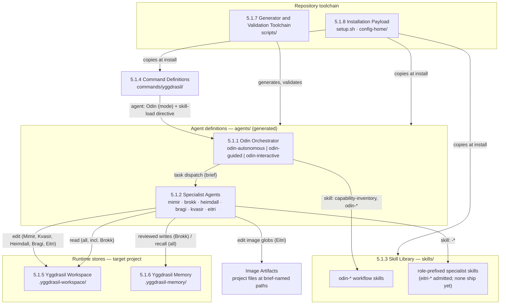

# 5.1 Whitebox Overall System

_Part of [Yggdrasil — Architecture (arc42)](../README.md) · [§5](README.md)._

The system decomposes along what OpenCode loads and what the repository ships: agent definitions (the orchestrator and the specialists), the skill library that carries workflow doctrine and specialist methods, the command definitions that route users into Odin, the two runtime stores in the target project, and the repository-side toolchain that generates, validates, and installs all of it. The decomposition motivation is the pair of standing goals S2 and S3: each block has exactly one kind of file, one owner role, and one enforcement mechanism (permission block, validator check, or installer rule). This revision adds one specialist to block 5.1.2 and touches blocks 5.1.1, 5.1.7, and 5.1.8 where the specialist roster is enumerated; blocks 5.1.3–5.1.6 are unchanged and not reproduced here.

| Building block | Responsibility | Code location | Evidence |
| --- | --- | --- | --- |
| 5.1.1 Odin Orchestrator | Receives the user request, determines the Deliverable, plans, dispatches specialists, enforces review gates, communicates per mode | `agents/odin-autonomous.md`, `agents/odin-guided.md`, `agents/odin-interactive.md` | `agents/odin-autonomous.md:1-302` |
| 5.1.2 Specialist Agents | Six role-bound subagents: Mimir (research), Brokk (implementation), Heimdall (review), Bragi (communication), Kvasir (strategy), **Eitri (design — image generation)** | `agents/mimir.md`, `agents/brokk.md`, `agents/heimdall.md`, `agents/bragi.md`, `agents/kvasir.md`, **`agents/eitri.md`** | context Workfile § Area Map row `agents/`; `agents/brokk.md:1-121`; this revision |
| 5.1.3 Skill Library | Workflow doctrine for Odin and method skills for each specialist, grouped by feature domain plus optional per-role bundles | `skills/{research,architecture,engineering,deliberation,memories}/`, `skills/{bragi,brokk,heimdall,kvasir,mimir}/` | directory listing of `skills/**`; `README.md:129-141` |
| 5.1.4 Command Definitions | Seven user-facing slash commands routing to a named Odin mode with a skill-load directive | `commands/yggdrasil/*.md` | `commands/yggdrasil/research.md:1-13` |
| 5.1.5 Yggdrasil Workspace | Transient, gitignored, task-scoped Workfile exchange between specialists | `.yggdrasil-workspace/<yyyymmdd>-<task-slug>-<xx>/` in the target project | `agents/odin-autonomous.md:74-82` |
| 5.1.6 Yggdrasil Memory | Persistent, git-tracked, source-cited knowledge base with an `INDEX.md` manifest | `.yggdrasil-memory/` in the target project | `agents/odin-autonomous.md:84-90` |
| 5.1.7 Generator and Validation Toolchain | Generates the **nine** agent files from templates and fragments; validates structure and parity | `scripts/` | `scripts/README.md:1-170`; `scripts/generate-subagents.sh:1-175` |
| 5.1.8 Installation Payload | Copies agents, commands, skills, and the capability generator into the OpenCode configuration home; seeds the custom-capabilities scaffold; renders **six** role sections in the inventory | `setup.sh`, `config-home/generate-capabilities.sh`, `config-home/custom-capabilities.yaml` | `README.md:99-141`; `config-home/generate-capabilities.sh:323-463` |

**Important interfaces at this level** (each specified in the blackbox that provides it): the *brief / executive-summary* dispatch contract (5.1.1 ↔ 5.1.2), extended by the *image brief / image manifest* contract for Eitri; the *agent frontmatter permission contract* (5.1.2, enforced by OpenCode), extended by the *`model:` field* for Eitri; the *skill frontmatter contract* (5.1.3); the *command definition contract* (5.1.4); the *Workfile naming and path contract* (5.1.5); the *Memory entry schema* (5.1.6); the *generator assembly order, roster lists, and validator checks* (5.1.7); the *role vocabulary of the capability inventory* (5.1.8).
