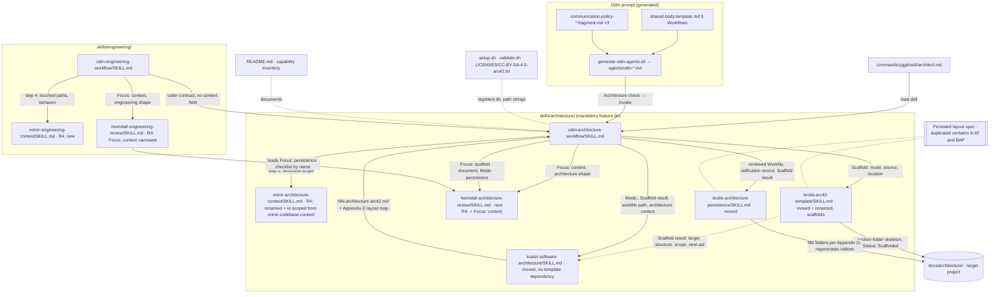

# 5.1 Whitebox Overall System

_Part of [Architecture Workflow (Yggdrasil) — Architecture (arc42)](../README.md) · [§5](README.md)._

Motivation: one feature directory per workflow family, each holding its Odin doctrine skill plus the specialists that serve it (the convention `research/`, `deliberation/`, `engineering/` already follow — context research §6). Every skill the Architecture workflow dispatches lives in `skills/architecture/`; `engineering/` holds only engineering-specific skills and reaches the architecture family by name (C-11). Revision 4 completes the separation for context gathering: each family has its own Mimir skill, scoped to what its consumers read, and the engineering workflow no longer dispatches any skill from the architecture directory except by loading `odin-architecture-workflow` itself. The arc42 skeleton is Brokk's: Brokk instantiates it (scaffold) and Brokk persists it; Kvasir only fills it.

| Building block | Responsibility | Changed by this objective? |
| --- | --- | --- |
| 5.1.1 `odin-architecture-workflow` | Orchestration doctrine for both modes; caller contract; scaffold step; review gates; persistence; Response | **New** (`skills/architecture/`) |
| 5.1.2 `commands/yggdrasil/architect.md` | Slash command → load the workflow skill | **New** |
| 5.1.3 Odin prompt templates | `§ Workflows` entry, trigger rules, Communication Policy thresholds | Modified |
| 5.1.4 `kvasir-software-architecture` | Dual-mode arc42 drafting; authors the Workfile from the scaffold's shape report and closes it with an Appendix D layout map; no template dependency | Modified; **moved** to `skills/architecture/`; **R5: Modified again** |
| 5.1.5 `heimdall-architecture-review` | Architecture-context review (R4), scaffold review, architecture-document review (both modes), persisted-directory review | **New** (`skills/architecture/`); R4: gains `Focus: context`; `heimdall-engineering-review` `Focus: context` narrowed to the engineering shape |
| 5.1.6 `odin-engineering-workflow` | Delegates architecture to 5.1.1; R4: engineering context step moves after the delegation (step 4), dispatches `mimir-engineering-context`; caller contract loses `context=` | Modified (R4 again) |
| 5.1.7 `brokk-architecture-persistence` | Fill the pre-scaffolded folder layout from the reviewed Workfile's Appendix D; regenerate indices; promote statuses | **R5: Modified** — map-driven, folder layout, can no longer create a structure; flat→folder migration on direction |
| 5.1.8 `mimir-architecture-context` (was `mimir-codebase-context`) | Structural facts for §5/§6/§8 and as-is documentation: boundaries, entry points, boundary interfaces, embodied cross-cutting concepts, existing architecture documentation, current-state view | **R4: renamed + re-scoped in place** (`skills/architecture/`); discipline text retained; behavior/conventions/test-infrastructure sections removed |
| 5.1.9 `README.md`, capability inventory | Document workflow; fix stale list; document new directory; regenerate | Modified / regenerated (R4: two Mimir slugs) |
| 5.1.10 Installer, validator, license notice | Register `architecture` as mandatory; clean relocated deployed copies; update template slug/path | Modified (R4: cleanup gains `architecture/mimir-codebase-context`) |
| 5.1.11 `brokk-arc42-template` (was `kvasir-arc42-template`) | Own the arc42 structure reference; **scaffold the section-folder skeleton in the target project**; classify shape; report `next-adr` | **R5: Modified** — writes to the target project, never a Workfile; no guidance text leaves the skill |
| 5.1.13 Persisted layout specification (folder per section) | The shared contract both Brokk skills implement and both reviewers check: folder names, index formats, topic-document naming, identity rule, promotion rule, status invariant | **R5: new** — text duplicated verbatim in 5.1.7 and 5.1.11 (ADR-0020) |
| 5.1.12 `mimir-engineering-context` | Behavioral facts for acceptance criteria and TDD: current behavior of touched paths, engineering conventions, test infrastructure with an executed baseline, interfaces the tests will call | **R4: new** (`skills/engineering/`); discipline text duplicated from 5.1.8 |
