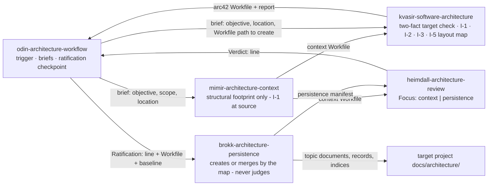

# 5.2 Level 2

_Part of [Yggdrasil — Architecture (arc42)](../README.md) · [§5](README.md)._

Three blocks have an internal structure the evidence supports describing.

**5.1.1 Odin Orchestrator — whitebox.** One generated file per mode, each composed of three parts in order (`scripts/README.md:13-16`): the *preamble* (frontmatter and title, mode-substituted), the *shared body* (Role, Responsibilities, Boundaries, Role Discipline, Agent Selection Guide, Conventions, Planning, Workflows, Execution, Review & Quality Gates — `agents/odin-autonomous.md:22-279`; source `scripts/odin-generator/shared-body.template.md`), and the *Communication Policy fragment* (`agents/odin-autonomous.md:280-302` for Autonomous: never ask, document assumptions, two terminal escalation actions, and the Trigger Thresholds that complete each workflow's trigger rules). The shared body is byte-identical across modes and carries the parity markers Check 7 validates (`scripts/README.md:73`).

**5.1.3 Skill Library — whitebox.** Two layers by loader: the *doctrine layer* (`odin-*` skills, one per packaged workflow plus `odin-memory-system`) that Odin loads on an `invoke` verdict and that defines the dispatch sequence, gates, cost model, and the workflow-fixed `Deliverable:` line (`agents/odin-autonomous.md:179`; `skills/architecture/odin-architecture-workflow/SKILL.md:10-24`); and the *method layer* (role-prefixed skills) that a specialist loads to execute one step of that sequence — e.g., the Architecture workflow's dispatched steps map onto `mimir-architecture-context` → `kvasir-software-architecture` → `brokk-architecture-persistence`, each reviewed session onto `heimdall-architecture-review` (`README.md:131`; directory listing of `skills/architecture/`). The install-side `capability-inventory` skill is the generated index over both layers (`scripts/README.md:162-166`).

**5.1.3 Skill Library — the architecture-workflow family (whitebox of one domain).** The five `SKILL.md` files under `skills/architecture/` form one family: a doctrine skill and four method skills that exchange fixed one-line grammars and Workfiles, and that share one invariant — the long-term-relevance test (I-1) — applied at the gathering step and the drafting step and checked mechanically at the persistence review. Nothing in this whitebox crosses the Skill Library's Level-1 boundary: the family's provided interface to the rest of the system is the workflow-fixed `Deliverable:` line and the frontmatter contract (5.1.3); the hand-offs below are internal to the family. The family has one form — there is no mode to select, no pre-drafting structure step, and no review of the draft.

| Blackbox (skill) | Code location | Step it executes | Provided hand-off (grammar owner) | Required inputs | Responsibility under I-1 |
| --- | --- | --- | --- | --- | --- |
| `odin-architecture-workflow` | `skills/architecture/odin-architecture-workflow/SKILL.md` | Trigger, briefs, ratification checkpoint, Response (`:37-59`) | `Deliverable:` (`:20-22`), `Context: skipped — <reason>` (`:37`), `Ratification:` (`:49-51`, echoed from the persistence skill's § The Ratification Record) | The Architecture check verdict `invoke`, or an enclosing workflow running it as a stage (`:28-29`) | Briefs the context step with scope = structural footprint and the four task-scoped exclusions (`:39`); records from the drafter's report the header's `Target:` and `Document scope:`, the `Section scope:` line, the decision list, the `Package check:` line, and the gaps, and surfaces the decisions at the checkpoint (`:41, 45`) |
| `mimir-architecture-context` | `skills/architecture/mimir-architecture-context/SKILL.md` | Context gate (step 1, conditional) | Context Workfile `NN-context-architecture-<area>.md` with a `## Scope` naming the exclusions (`:42, 69`) and an existing-documentation inventory with the highest record number (`:74`) | Brief with objective, declared scope, architecture location | Gathers only structural facts; never records a task-scoped fact (`:25, 112`) |
| `kvasir-software-architecture` | `skills/architecture/kvasir-software-architecture/SKILL.md` | Drafting (step 2, unreviewed) | arc42 Workfile `NN-architecture-arc42.md` with the header (`Target:`, `Document scope:`, `Records from:`, `Section scope:`), Appendix A records at `Status: Proposed`, Appendix B packages or `_None — no change decided_`, Appendix C layout map; report per § Output Contract | Objective, architecture location, Workfile path to create, requirements and context Workfile paths when they exist | Resolves exactly two target facts (identity rule → `Document scope`; highest record number → `Records from`); states I-1 once (§ Boundaries) and applies it per section; writes I-2 markers; obeys I-3 references; applies the refresh rule; writes the I-5 layout map |
| `heimdall-architecture-review` | `skills/architecture/heimdall-architecture-review/SKILL.md` | The two review gates — context (step 1) and persistence (step 4) (`Focus: context \| persistence`, `:54`) | `Verdict:` line; review Workfile `NN-review-context-architecture-<area>.md` or `NN-review-architecture-persistence.md` (`:101`) | `Focus:`, the originating brief, artifact paths, pinned baseline | Under `Focus: context` a note-level item on task-scoped facts (`:80`); under `Focus: persistence` the mechanical checks of I-4, I-5, and I-7 — existence rule at baseline (`:88`), map ⇔ tree with row-backed supersession and carried-forward documents absent from the diff (`:89`), no persisted `_Not affected by this change_` (`:91`), record numbering re-derived and every new record opened (`:93`), three greps all expected zero (`:94`), Mermaid blocks cleared by a named method (`:64`) |
| `brokk-architecture-persistence` | `skills/architecture/brokk-architecture-persistence/SKILL.md` | Persistence (step 4, unless declined) | Persistence manifest; the fixed folder table (`:42`); the generated section and top indices (`:80`); § The Ratification Record grammar (`:105`) | Architecture Workfile with Appendix C, `Ratification:` line, pinned baseline | Verifies the header against the tree and writes nothing on disagreement; creates the twelve-folder layout on `seed` over an absent target, otherwise fills the existing layout by the map (`:134`); copies markers verbatim (I-2); never deletes and never edits an existing record (`:134, 158`) |

**Invariants of the family** — each is a contract a test can be written against (the test seam is the skill text plus a fixture-driven dry run). Text in fixed-width type is the exact wording the skills carry.

- **I-1 — The long-term-relevance test** (ADR-0010; DOC-1, DOC-2, DOC-3, DOC-4). Stated once, in `kvasir-software-architecture` § Boundaries, and referenced by name from `mimir-architecture-context` § Boundaries (`:25`):

  > `A statement belongs in §1–§12 only if it would still be true and useful to a reader of the persisted document after the triggering task is complete: it describes a boundary, an interface, a decision and its rationale, a quality goal, a stable mechanism, or a risk to the system. A statement about how this run was performed, what one work package does inside a block, a temporary measure, or anything that resolves only inside the task's workspace is task-scoped: it belongs in Appendix B, in the report, or nowhere.`

  The test carries one **tell-tale list** in the drafting skill: workspace paths of the form `.yggdrasil-workspace/<yyyymmdd>-…`; task directory names; Workfile filenames; a review verdict or a reviewer cited as this document's provenance; revision, contradiction, and inputs logs; run provenance phrased as time ("at the time of writing", "in this run"); work-package names or sequencing; feature flags, rollout steps, temporary workarounds, and task-specific test-harness setup; internal helper structure, local control flow, naming inside a block, test-case selection; and run-local identifiers not defined in §1.1. **Per-section application** in the drafting skill: §4 names decisions and rationale, never rollout or sequencing; §5 carries boundaries, interfaces, invariants, code locations — never helper structure, naming, or test selection; §6 traces only flows that cross a module boundary or realize a quality goal; §8 carries only mechanisms that persist — a temporary measure is a §11 risk with its retirement condition; §9 records only decisions that pass the significance test. **Scope application:** identical in `seed` and `update delta`; in the latter the **refresh rule** applies to each re-authored document — carry every durable statement forward, drop every task-scoped one. A document carried forward without re-authoring is not refreshed (§11 R12).

- **I-2 — Typed omission markers and the `Section scope:` line** (ADR-0011; DOC-6, DOC-7). A closed set of three strings, written in no other wording:

  | Marker | Type | Used for |
  | --- | --- | --- |
  | `_Omitted — not architecturally significant for this objective_` | scope | nothing durable to write here for this objective — a section or subsection in either document scope |
  | `_Omitted — no evidence in context Workfile_` | evidence | the evidence base does not cover it — a section or subsection in either document scope |
  | `_Not affected by this change_` | unaffected | update-delta scope only: a whole section the delta does not write — persistence never writes this one into the tree |

  The header and report line is `Section scope: included=<§N[, §N …]>, omitted=<§N[, §N …]>`; the omission type is carried by the marker text under each omitted heading. The persistence step copies a scope or evidence marker verbatim into the section index and never writes the unaffected marker (`brokk-architecture-persistence/SKILL.md:80`); a persisted `_Not affected by this change_` is a blocking finding at the persistence review (`heimdall-architecture-review/SKILL.md:91`).

- **I-3 — Document-stable references** (ADR-0012; DOC-8). Persisted sections cite only: repository paths with optional `:line` ranges; section and subsection numbers of this document; decision-record IDs; and requirement IDs that §1.1 of this document defines. The inputs' acceptance-criterion IDs (`AC-n`) never appear in §1–§12: the drafter defines document-stable requirement IDs in §1.1 under a prefix that does not collide with any ID already persisted there (e.g. `DOC-n` here), restates each realized criterion under such an ID, and cites those IDs from §5, §6, and §10. Workspace paths, task directories, Workfile names, review verdicts, and `AC-n` tokens appear only in Appendix B and the report.

- **I-4 — Relevance enforcement without a review of the draft** (ADR-0016; DOC-5). Three points, none of them a review of the Workfile: the author's boundary (I-1, judgment); a **note-level** item under `Focus: context` — a task-scoped fact in the context Workfile is named, not blocked, because the context Workfile is never persisted (`heimdall-architecture-review/SKILL.md:80`); and, under `Focus: persistence`, three greps over the persisted target — `arc42 guidance`, `.yggdrasil-workspace`, and the task-directory name — every hit **blocking** (`:94, 97`). No item anywhere blocks on length, document count, or the number of documents a section holds. Judgment-level defects in the draft — a task-scoped paragraph phrased without a tell-tale pattern — pass through to the ratification checkpoint and the project (§11 R11).

- **I-5 — Document-granular update deltas** (ADR-0014, ADR-0017; DOC-4, DOC-12). In update-delta scope Appendix C names only the topic documents the delta writes. A row form `| <existing document heading> | → superseded — <reason> | — |` names an existing document the delta retires. A document of an included section that the map neither names nor supersedes is **carried forward**: the persistence step leaves it byte-identical and lists it in the regenerated section index at its existing ordinal. Ordinals of carried-forward and re-authored documents are fixed; new documents continue the folder's sequence. `brokk-architecture-persistence` § Workflow step 5 replaces exactly the named documents, supersedes exactly the `→ superseded` rows, regenerates the index from the union of the three cases, appends to the decision log without rewriting a row, and never deletes or creates a folder (`:134`); "Superseded documents" are files a map explicitly supersedes (`:80`). The fixed folder table — the twelve folder names and their one-line descriptions — lives in the persistence skill alone (`:42`); its description column is word-identical to the `Holds` column of the drafting skill's § Document Shape, so a description change is a two-file edit (§11 R17). The persistence review checks map ⇔ tree in both directions, carried-forward documents absent from the diff, and every "Superseded documents" entry row-backed (`heimdall-architecture-review/SKILL.md:89`).

- **I-6 — Source of truth and propagation** (ADR-0009; DOC-9). The five skills are edited in the repository's `skills/architecture/<skill>/SKILL.md`; `./setup.sh -y` copies them to `<config-base>/skills/yggdrasil/architecture/` (`setup.sh:354-358`, `cp -R`); after propagation `git diff --no-index --stat skills/architecture <config-base>/skills/yggdrasil/architecture` prints nothing. `scripts/validate.sh` Checks 2 and 3 (five sections in order; `name:` equals slug) must pass on every edited skill (`scripts/README.md:63-72`).

- **I-7 — Two-fact target check, header ⇔ tree** (ADR-0015, ADR-0016; DOC-10, DOC-11). The drafter derives exactly two facts from the target and writes them into the header: the **identity rule** — the folder layout exists if and only if `README.md` and `01-introduction-and-goals/README.md` are both present → `Document scope: update delta`, else `seed`; and the highest decision-record number across `<location>/09-architecture-decisions/`, `docs/adr/`, `docs/decisions/`, and `adr/` → `Records from:` the next number (`kvasir-software-architecture/SKILL.md` § Workflow step 1). The persistence session re-derives both at its pinned baseline and writes nothing when either disagrees with the header; a failed precondition is a drafting-side defect — the orchestrator resumes the drafter once to correct the header and re-dispatches persistence, never re-briefing persistence to fit (`odin-architecture-workflow/SKILL.md:55-57`). The persistence review re-derives both again — a seed over a present layout, a delta over an absent one, or a record number colliding with or skipping past the baseline's highest is blocking (`heimdall-architecture-review/SKILL.md:88, 93, 97`).
