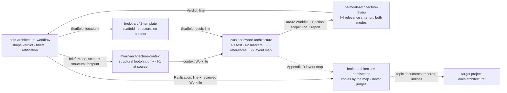

# 5.2 Level 2

_Part of [Yggdrasil — Architecture (arc42)](../README.md) · [§5](README.md)._

Three blocks have an internal structure the evidence supports describing.

**5.1.1 Odin Orchestrator — whitebox.** One generated file per mode, each composed of three parts in order (`scripts/README.md:13-16`): the *preamble* (frontmatter and title, mode-substituted), the *shared body* (Role, Responsibilities, Boundaries, Role Discipline, Agent Selection Guide, Conventions, Planning, Workflows, Execution, Review & Quality Gates — `agents/odin-autonomous.md:22-279`), and the *Communication Policy fragment* (`agents/odin-autonomous.md:280-302` for Autonomous: never ask, document assumptions, two terminal escalation actions, and the Trigger Thresholds that complete each workflow's trigger rules). The shared body is byte-identical across modes and carries the parity markers Check 7 validates (`scripts/README.md:73`).

**5.1.3 Skill Library — whitebox.** Two layers by loader: the *doctrine layer* (`odin-*` skills, one per packaged workflow plus `odin-memory-system`) that Odin loads on an `invoke` verdict and that defines the dispatch sequence, gates, cost model, and return-line grammar (`agents/odin-autonomous.md:179`; `skills/architecture/odin-architecture-workflow/SKILL.md:1-12`); and the *method layer* (role-prefixed skills) that a specialist loads to execute one step of that sequence — e.g., the Architecture workflow's steps map onto `mimir-architecture-context` → `brokk-arc42-template` → `kvasir-software-architecture` → `heimdall-architecture-review` → `brokk-architecture-persistence` (`README.md:131`; directory listing of `skills/architecture/`). The install-side `capability-inventory` skill is the generated index over both layers (`scripts/README.md:162-166`).

**5.1.3 Skill Library — the architecture-workflow family (whitebox of one domain).** The six `SKILL.md` files under `skills/architecture/` form one family: a doctrine skill and five method skills that exchange fixed one-line grammars and Workfiles, and that share one invariant — the long-term-relevance test (I-1) — applied at the gathering step, the drafting step, and the review gate. Nothing in this whitebox crosses the Skill Library's Level-1 boundary: the family's provided interface to the rest of the system remains the `Architecture result:` return line (5.1.3) and the frontmatter contract; the hand-offs below are internal to the family.

| Blackbox (skill) | Code location | Step it executes | Provided hand-off (grammar owner) | Required inputs | Responsibility under I-1 |
| --- | --- | --- | --- | --- | --- |
| `odin-architecture-workflow` | `skills/architecture/odin-architecture-workflow/SKILL.md` | Shape verdict, briefs, ratification, return line (`:76-142`) | `Architecture shape:` (`:81`), `Ratification:` (`:125`), `Architecture result:` (`:60`) | User request or `Architecture request:` line (`:48`) | Briefs the context step with scope = structural footprint (`:92`); records the drafter's `Section scope:` line and its scope rationale at step 4 and surfaces both at the checkpoint (step 6) |
| `mimir-architecture-context` | `skills/architecture/mimir-architecture-context/SKILL.md` | Context gate (Odin step 2) | Context Workfile `NN-context-architecture-<area>.md` (`:72-85`) | Brief with mode and scope | Gathers only structural facts; records no task-scoped fact (I-1 exclusion list); declares exclusions in `## Scope` |
| `brokk-arc42-template` | `skills/architecture/brokk-arc42-template/SKILL.md` | Scaffold (Odin step 3) | `Scaffold result:` (quoted in `odin-architecture-workflow/SKILL.md:105`) | `Scaffold: location=` | None — writes structure, never content; carries the normative copy of § The Persisted Layout together with the persistence skill (I-5) |
| `kvasir-software-architecture` | `skills/architecture/kvasir-software-architecture/SKILL.md` | Drafting (Odin step 4) | arc42 Workfile `NN-architecture-arc42.md`; `Section scope:` line; report (§ Output Contract) | `Mode:`, `Scaffold result:`, requirements and context Workfiles | States I-1 once (§ Boundaries), applies it per section (§ Workflow steps 3, 5–8), writes I-2 markers, obeys I-3 references, applies the refresh rule, writes the I-5 layout map |
| `heimdall-architecture-review` | `skills/architecture/heimdall-architecture-review/SKILL.md` | Every review gate (`Focus: context / scaffold / document / persistence`) | `Verdict:` (`:26`) | `Focus:`, `Mode:`, artifact paths, pinned baseline | Enforces I-4: one shared long-term-relevance item under `Focus: document` for both modes with a blocking condition; a note-level item under `Focus: context`; I-2 marker check; I-5 supersession checks under `Focus: document` and `Focus: persistence` |
| `brokk-architecture-persistence` | `skills/architecture/brokk-architecture-persistence/SKILL.md` | Persistence (Odin step 7) | Persistence manifest (`:280`) | Reviewed Workfile with Appendix D, `Ratification:`, `Scaffold result:`, baseline | Copies markers verbatim (I-2); in update-delta scope replaces exactly the documents the map names and supersedes exactly the rows that say so (I-5) |

**Invariants of the family** — each is a contract a work package implements and a test can be written against (the test seam is the skill text plus a fixture-driven dry run; see Appendix B). Text in fixed-width type is the exact wording the skills carry.

- **I-1 — The long-term-relevance test** (ADR-0010; DOC-1, DOC-2, DOC-3, DOC-4). Stated once, in `kvasir-software-architecture` § Boundaries, and referenced by name from `mimir-architecture-context` § Boundaries and `heimdall-architecture-review` § Focus: document:

  > `A statement belongs in §1–§12 only if it would still be true and useful to a reader of the persisted document after the triggering task is complete: it describes a boundary, an interface, a decision and its rationale, a quality goal, a stable mechanism, or a risk to the system. A statement about how this run was performed, what one work package does inside a block, a temporary measure, or anything that resolves only inside the task's workspace is task-scoped: it belongs in Appendix B or C, in the report, or nowhere.`

  The test carries one **tell-tale list**, identical in the drafting and the review skill: workspace paths of the form `.yggdrasil-workspace/<yyyymmdd>-…`; task directory names; Workfile filenames; a review verdict or a reviewer cited as provenance of this document (a verdict quoted as doctrine the system embodies is not a tell-tale); revision, contradiction, or inputs logs; run provenance phrased as time ("at the time of writing", "in this run"); work-package names or sequencing; feature flags, rollout steps, temporary workarounds, sprint- or task-specific test-harness setup; internal helper structure, local control flow, naming inside a block, test-case selection; and run-local identifiers not defined in §1.1. **Per-section application** in the drafting skill: §4 names decisions and rationale, never rollout or sequencing; §5 carries boundaries, interfaces, invariants, quality characteristics, code locations — never helper structure, naming, or test selection; §6 traces only flows that cross a module boundary or realize a quality goal — never a flow local to one work package; §8 carries only mechanisms that persist after the objective — never a workaround introduced for it; §9 records only decisions expensive to reverse — an implementation-phase choice the ratifier wants recorded goes into the owning package's done criterion in Appendix B. **Mode application:** identical in `decide-new` and `document-existing`; in the latter the §1.1 evidence-base statement names repository paths and a date, never a Workfile path or a review verdict. **Scope application:** identical in `seed` and `update delta`; in the latter the **refresh rule** applies — `A document this delta re-authors carries forward every durable statement of its persisted version and drops every task-scoped statement; each dropped statement is listed in the report under "Refreshed".` A document carried forward without re-authoring is listed under "Carried forward" and is not refreshed.

- **I-2 — Typed omission markers and the `Section scope:` grammar** (ADR-0011; DOC-6, DOC-7). A closed set of three strings, selected by this table and written nowhere else in any other wording:

  | Marker | Type | Used for |
  | --- | --- | --- |
  | `_Omitted — not architecturally significant for this objective_` | scope | seed scope, either mode: a section or subsection the objective's durable content does not reach; in update-delta scope: a subsection of an included section that the re-authored section leaves empty |
  | `_Omitted — no evidence in context Workfile_` | evidence | seed scope, `document-existing`: a section the evidence base does not cover; also for a subsection of an included section in an update-delta refresh |
  | `_Not affected by this change_` | unaffected | update-delta scope, either mode: a whole section the delta does not write — the persisted section stands as it is |

  The header and report line becomes `Section scope: included=<§N[, §N …]>, omitted=<§N (scope | evidence | unaffected)[, §N (…) …]>` — the type tag in parentheses after each omitted section is mandatory. The report carries two further items directly after that line: `Scope rationale:` — one clause per omitted section, and one clause per included section whose content was deliberately minimized under I-1 — and, in update-delta scope, `Refreshed:` / `Carried forward:` lists per I-1. The persistence step's handling is unchanged: a scope or evidence marker is copied verbatim into the section index; the unaffected marker is never written to the project.

- **I-3 — Document-stable references** (ADR-0012; DOC-8). Persisted sections cite only: repository paths with optional `:line` ranges; section and subsection numbers of this document; decision-record IDs; and requirement IDs that §1.1 of this document defines. The Workfile's acceptance-criterion IDs (`AC-n`) never appear in §1–§12: the drafter defines document-stable requirement IDs in §1.1 under a prefix that does not collide with any ID already in the persisted §1.1 (e.g. `DOC-n` here), restates each realized criterion under such an ID, and cites those IDs from §5, §6, and §10; Appendix C maps `AC-n` → document ID → building block → ADR → package. Workspace paths, task directories, Workfile names, review verdicts, and revision entries appear only in Appendices B–D and the report.

- **I-4 — The review criterion** (ADR-0013; DOC-5). `heimdall-architecture-review` § Focus: document gains one item among the shared items that precede both mode checklists — **Long-term relevance** — with this contract: read every filled §1–§12 section against the I-1 tell-tale list; **blocking** when a section or a whole paragraph consists only of task-scoped content, or when any workspace path, task directory, Workfile name, review verdict, or revision log appears in §1–§12; a **note** naming the location when a single task-scoped clause sits inside otherwise durable content; **never** a finding on length, document count, or the number of documents a section holds. In update-delta scope the item also checks the report's `Refreshed:` list against the re-authored documents' persisted versions (a dropped durable statement is blocking; a retained task-scoped statement is a note). The marker check in the `decide-new` list is rewritten against the I-2 table (a marker outside the closed set, or a `Section scope:` entry without its type tag, is a note). `Focus: context` gains a **note-level** item: a task-scoped fact in the context Workfile — runner commands, conventions for new code, test infrastructure, current behavior of touched paths — is named as a note, not a blocker, because the drafter filters and the reviewer of the document blocks.

- **I-5 — Document-granular update deltas** (ADR-0014; DOC-4). In update-delta scope Appendix D names only the topic documents the delta writes. A fourth row form is added to the layout map: `| <existing document heading> | → superseded — <reason> | — |`, naming an existing document the delta retires. A document of an included section that the map neither names nor supersedes is **carried forward**: the persistence step leaves it byte-identical and lists it in the regenerated section index in its existing ordinal position. Ordinals of carried-forward and re-authored documents are fixed; new documents continue the folder's sequence. `brokk-architecture-persistence` § Workflow step 5 replaces exactly the named documents, supersedes exactly the `→ superseded` rows, and regenerates the index from the union of carried-forward, re-authored, and new documents; the "Superseded documents" definition in § The Persisted Layout changes from "files a later map no longer names" to "files a later map explicitly supersedes", and that section is copied byte-for-byte into `brokk-arc42-template` (the two skills carry it verbatim). `heimdall-architecture-review` checks, under `Focus: document` (update-delta item), that every existing document of an included section is mapped, superseded, or listed under `Carried forward:` in the report, and, under `Focus: persistence` item (b), that every "Superseded documents" entry corresponds to a `→ superseded` row and that carried-forward documents are byte-identical to the baseline.

- **I-6 — Source of truth and propagation** (ADR-0009; DOC-9). The six skills are edited in the repository's `skills/architecture/<skill>/SKILL.md`; `./setup.sh -y` copies them to `<config-base>/skills/yggdrasil/architecture/` (`setup.sh:354-358`, `cp -R`); after propagation `git diff --no-index --stat skills/architecture <config-base>/skills/yggdrasil/architecture` prints nothing. `scripts/validate.sh` Checks 2 and 3 (five sections in order; `name:` equals slug) must pass on every edited skill (`scripts/README.md:63-72`).
