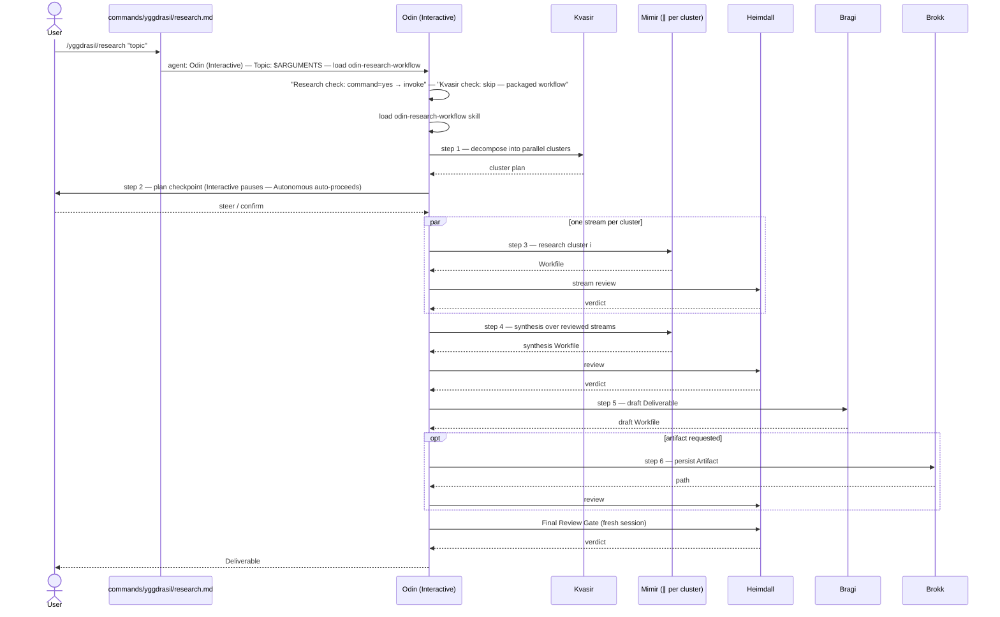

# 6.2 Slash Command into the Packaged Research Workflow

_Part of [Yggdrasil — Architecture (arc42)](../README.md) · [§6](README.md)._

The command path, using `/yggdrasil/research` as the instance. Read from `commands/yggdrasil/research.md:1-13`, `agents/odin-autonomous.md:172-199, 298`, and `skills/research/odin-research-workflow/SKILL.md:22-39` (via the context Workfile). Realizes goals 1 and 4.

**Error path actually taken.** A `BLOCKED` stream review resumes the Mimir session once; if it stays blocked, the workflow stops and surfaces the failure rather than proceeding to synthesis on unreviewed material (context Workfile § Cross-cutting Concepts item 8; `agents/odin-autonomous.md:267-279`). The plan checkpoint's pause behavior is a Communication Policy threshold: Autonomous auto-proceeds and rides the summary on the final disclosure (`agents/odin-autonomous.md:298`).
