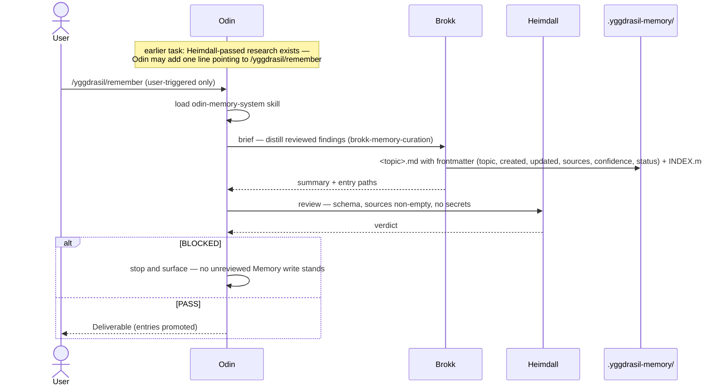

# 6.3 Memory Promotion via Remember

_Part of [Yggdrasil — Architecture (arc42)](../README.md) · [§6](README.md)._

The only write path into `.yggdrasil-memory/`. Read from `agents/odin-autonomous.md:84-90`, `skills/memories/odin-memory-system/SKILL.md:24-31, 57-61`, and `skills/memories/brokk-memory-curation/SKILL.md:91-110` (via the context Workfile). Realizes goals 4 and 1.

**Error path actually taken.** A blocked review on a Memory write is not retried into place; the pipeline stops (context Workfile § Cross-cutting Concepts item 8, "Memory write review BLOCKED → no resume; stop", marked implicit in the skill text). Secrets and credentials are refused at promotion (`skills/memories/odin-memory-system/SKILL.md:31, 58`). Dream and Forget follow the same review-gated shape with Mimir auditing (Dream) and an explicit user confirmation of scope (Forget) (`skills/memories/odin-memory-system/SKILL.md:33-52`).
