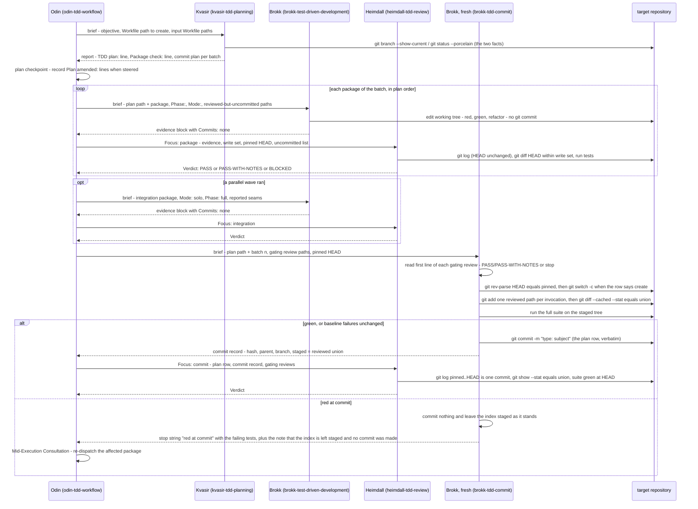

# 6.4 Review-Gated Batched Commit in the TDD Workflow

_Part of [Yggdrasil — Architecture (arc42)](../README.md) · [§6](README.md)._

The path by which code reaches a target project's history: one batch of the TDD plan, from the plan checkpoint to the reviewed commit. The flow is the same whether the workflow was entered by its own `TDD check` verdict or as the Software Engineering workflow's stage. Read from `skills/tdd/odin-tdd-workflow/SKILL.md:42-69` (§ Workflow steps 2–7 and failure handling), `skills/tdd/brokk-tdd-commit/SKILL.md:60-71`, and `skills/tdd/heimdall-tdd-review/SKILL.md:61, 103, 116-129`. Realizes system goals 1, 2, and 4 and TDD-3, TDD-5, TDD-6, TDD-7, TDD-9. The context gate (step 1) and the Response (step 7) are omitted; they follow 6.1's pattern. The standalone safety stop (§5.2 T-7) sits between the plan report and the plan checkpoint and is not drawn: when it fires there is no batch.

**Error paths actually taken.** A `BLOCKED` package or integration review follows Failed Review Classification: the producing session is resumed once for an execution defect; a plan-level mismatch or a second `BLOCKED` ends the run with that batch uncommitted, the work left in the tree and disclosed — the workflow never reverts, stashes, or deletes working-tree changes (`odin-tdd-workflow/SKILL.md:67`, § Workflow "Failure handling"). A `BLOCKED` commit review is the one case where the artifact is already history: the commit session is resumed once to land a corrective commit for a staging omission and both commits are disclosed; anything else ends the run with the review path named; history is never rewritten (`:69`; `heimdall-tdd-review/SKILL.md:129`). A red suite at commit time is not a review failure: the commit session commits nothing, leaves the index staged exactly as it stands — the staged set is the evidence the next session inspects, and undoing the staging is not this step's call — and reports `red at commit — <failing tests>` with `index left staged for inspection; no commit made`; Odin re-dispatches the affected package under Mid-Execution Consultation (`brokk-tdd-commit/SKILL.md:66`; `odin-tdd-workflow/SKILL.md:63, 69`). Every git command the commit session runs — `rev-parse`, `switch -c`, `add`, `rm`, `mv`, `diff --cached`, `commit -m`, `show`, `status` — is in the Brokk permission block's allow list (`agents/brokk.md:10-29`). A `HEAD` that moved between the pinned reference and the commit session, or a tree path outside the reviewed union and the baseline-dirty list, stops the commit session before staging (`brokk-tdd-commit/SKILL.md:61, 63`).
