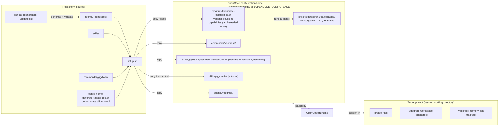

# 7. Deployment View

_Part of [Yggdrasil — Architecture (arc42)](../README.md) · [§7](README.md)._

Yggdrasil has two deployment sites: the **repository** (source of truth, where generators run) and the **OpenCode configuration home** (where the definitions execute), plus the **target project** where a session runs and the runtime stores live. Evidence: `README.md:100-152`, `scripts/README.md:162-166`, `agents/odin-autonomous.md:78, 86`.

| Node | Contents | Lifecycle | Evidence |
| --- | --- | --- | --- |
| Repository | Templates, generated agents, skills, commands, installer, install payload, this architecture document | Edited by maintainers; `validate.sh` gates commits of generated files | `scripts/README.md:105-151` |
| Configuration home | Installed copies; the generated capability inventory; the operator-owned `custom-capabilities.yaml` | Overwritten per Yggdrasil file on upgrade, unrelated files preserved, `custom-capabilities.yaml` never overwritten; inventory regenerated on every install | `README.md:106, 118, 122` |
| Target project | Artifacts, transient Workspace, persistent Memory | Workspace never committed; Memory recommended git-tracked and modified only by pipelines | `agents/odin-autonomous.md:78, 86` |

**Not evidenced.** Runtime infrastructure of OpenCode itself (model endpoints, tool execution sandbox) and any CI pipeline that runs the smoke tests — out of the context Workfile's scope.
